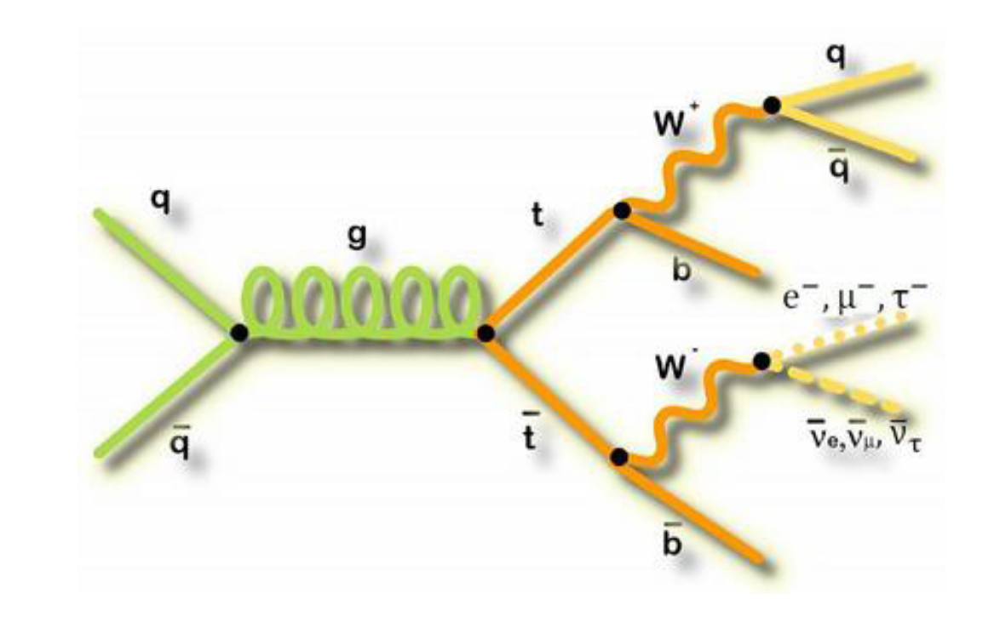

# Exercise 1 - Datasets, Selections and Histograms

For the exercises, we will use a simplified version of a [CMS analysis](https://link.springer.com/content/pdf/10.1007/JHEP09(2017)051.pdf) to measure the production cross-section of top-quark / anti-top-quark pairs - $\sigma_{tt}$ - in proton-proton collisions at a centre of mass energy of 13 TeV. We will be using real data from the CMS experiment, taken in 2015 during Run 2 of the LHC. The code is based on the CMS open data workshop linked [here](https://cms-opendata-workshop.github.io/workshopwhepp-lesson-ttbarljetsanalysis/), which you can read through if you are interested. 

The image below is a Feynman diagram of the process we are interested in measuring, namely $t\bar{t}\rightarrow (bW^{+})(bW^{-})\rightarrow bq\bar{q}bl^{-}\bar{\nu}_{l}$ - the lepton+jets final state. 



In our example, we will focus on the case where the lepton $l$ is an electron or muon.  In the CMS detector, these leptons are extremely well measured and are very good for "triggering" the events that we are interested in. Looking at the final state, we would also expect to see 4 hadronic jets, two of which will be $b-$jets, and missing transverse momentum from the neutrino which isn't detected.  

## Launch JupyterLab

For this exercise, we will be using data from the LHC Run-2 proton-proton collision data recorded by CMS during 2015. 
In addition to the data, we will be using simulated samples of $t\bar{t}\rightarrow (bW^{+})(bW^{-})\rightarrow bq\bar{q}bl^{-}\bar{\nu}_{l}$ production and various background processes that can mimic the signal. 

First, start the `cms_python` container using 
```
docker start -i cms_python
```
Note that you should have the Docker desktop running on your laptop for this to work. If you didn't install the container already, please see the [Getting started](https://nucleosynthesis.github.io/LHCDataStatisticsICISE2024/setup/) pages before continuing. 

Next, you should checkout the GitHub area that contains some helpful files and information for accessing and processing the data. In the same terminal as you started the container in type, 
```
git clone https://github.com/nucleosynthesis/LHCDataStatisticsICISE2024.git
cd LHCDataStatisticsICISE2024/ttbarAnalysis 
```

Now you can start the JupyterLab server by running 
```
jupyter lab --ip 0.0.0.0 --port 8888 --no-browser
```

The output will give you a link (starting with `http://`) that you can paste into your preferred internet browser to open the JuypterLab session. Create a new Python 3 notebook - icon that says *Python 3 (ipykernel)* - and give it a name by clicking at the top where it says "Untitled.ipynb". We will use this notebook to issue commands to process the data. 

You can create new cells in the notebook by using the "+" icon at the top. The code that is entered in each cell can be run by either clicking the play icon at the top or by selecting the cell and pressing **Shift + Enter** on your keyboard. Jupyter notebooks are a great way of editing code and displaying output all in one place! 

## Accessing and exploring the data sets

In your JupyterLab file browser, you will see the list of files that were obtained from GitHub. There is a file called `ntuples.json` that contains the file paths for the different samples (data and simulation) that we'll use in these exercises. 

In the file browser, if you click on the `ntuple.json` file, it will open in the main panel. You can click on the different names to expand them and see the information contained in the file. It should look like the image below, 


These datasets have been *skimmed* by applying certain selection criteria. This is to make the samples more manageable as the original datasets are TBs in size! The requirements applied are, 

   - That the events fired at least one of these triggers: `HLT_Ele22_eta2p1_WPLoose_Gsf`, `HLT_IsoMu20_v`, `HLT_IsoTkMu20_v`. These essentially require that the online selection (trigger) found at least one isolated electron or one isolated muon with a minimum $p_{T}$, in a certain part of the CMS detector (can you figure out from the names, what the $p_{T}$ requirements at the online selection are?). 
   - That the event contains either at least one tight electron or at least one tight muon with $p_{T}> 26$ GeV and $|\eta|<2.1$. When we use the word tight in this context, it is jargon internal to CMS that just specifies how pure we are trying to make the sample. A tight selection criteria would be quite pure and have fewer false positives than a medium or loose selection which might retain more true muons or electrons, but also have more false positives (fake electrons or muons). 

The data are saved as `.root` files. Don't worry if you are not familiar with the ROOT software, we will some very nice Python tools from the Hep Software Foundation to read these files and convert them into Python based formats. 

Copy the code below into a cell in your Jupyter notebook. This imports the various modules that we need to read and convert our data into Python formats. 

```python
import uproot
import numpy as np
import awkward as ak
from coffea.nanoevents import NanoEventsFactory, BaseSchema
from agc_schema import AGCSchema
```

Run the cell to execute the commands. You should see the cell number (eg `[1]`) become an asterisk (`[*]`) for a short while, which indicates that the cell is running. Once the commands have finished, the number will appear again. 

Next, let's open one of the files from the `ttbar` sample. Copy the command below into the next cell of your Jupyter notebook and run it. 

```python 
events = NanoEventsFactory.from_root('root://eospublic.cern.ch//eos/opendata/cms/derived-data/POET/23-Jul-22/RunIIFall15MiniAODv2_TT_TuneCUETP8M1_13TeV-powheg-pythia8_flat/00EFE6B3-01FE-4FBF-ADCB-2921D5903E44_flat.root', schemaclass=AGCSchema, treepath='events').events()

print(events.fields)
```

The output should be a list of the different collections (fields) that are contained in the data. Each event may have a different number of objects in each collection. We can see this by entering the following code in the Jupyter notebook cell, 

```python
print("Electrons:")
print(f"Number of events: {ak.num(events.electron, axis=0)}")
print(ak.num(events.electron, axis=1))
print()
```

The output should look like 
```
Electrons:
Number of events: 325519
[3, 2, 2, 1, 1, 2, 0, 1, 2, 3, 1, 1, 3, 4, ... 4, 1, 1, 2, 5, 3, 1, 2, 2, 2, 1, 2, 1]
```

From this we can see that there are 325519 events in total in this file and each event has a different number of electrons. Notice that we used the same `ak.num` command in each printout but we changed the depth of the sum by specifying `axis=`. The larger this number, the deeper into the event structure the function goes. 

!!! Question
    Do the same for `muon`, `jet` and `met` in each event, to see how many of these objects are contained in each event. Why do you get an error when using the function for `met`, the missing transverse momentum of the event?  

<details>
<summary><b>Show answer</b></summary>

Similarly to the case for electrons, we can use the following, 
```python
print("Muons:")
print(f"Number of events: {ak.num(events.muon, axis=0)}")
print(ak.num(events.muon, axis=1))
print()

print("Jets:")
print(f"Number of events: {ak.num(events.jet, axis=0)}")
print(ak.num(events.jet, axis=1))
```

Which yields the output, 
```
Muons:
Number of events: 325519
[1, 1, 1, 0, 6, 6, 3, 2, 1, 2, 2, 6, 4, 2, ... 2, 1, 1, 2, 0, 5, 2, 3, 2, 2, 2, 2, 1]

Jets:
Number of events: 325519
[4, 5, 4, 5, 9, 4, 4, 8, 5, 9, 5, 4, 6, 6, ... 6, 2, 4, 3, 5, 9, 4, 7, 4, 4, 6, 5, 4]
```

When doing the same for <code>met</code>, we get an error 
```
ValueError: 'axis' out of range for 'num'
``` 

The reason is that the <code>met</code> field is an <b>event level variable</b> meaning it is calculated only once per event. 
</details>

## Applying a basic analysis selection

We will apply selections to the events to discard those that are unlikely to have arisen from our target (signal) process $t\bar{t}\rightarrow (bW^{+})(bW^{-})\rightarrow bq\bar{q}bl^{-}\bar{\nu}_{l}$. 

Looking at the process, its clear that we should select events that have one muon or one electron, along with at least four jets which are either from a light flavour quark or from a b-quark ($q$ or $b$). 

Generally, when applying selections to events, we first think about *object selection* - i.e we only want to apply event selections using well identified objects, and then *event selection* where we really target the final state that we are looking for. 

### Object selection 

We can see which features each of our collections have by checking the `fields` available. Copy the following code into a Juptyer notebook cell, 
```python
print("Electron fields:")
print(events.electron.fields)
print()
```
This should give the following output, 

```
Electron fields:
['pt', 'px', 'py', 'pz', 'eta', 'phi', 'ch', 'iso', 'veto', 'isLoose', 'isMedium', 'isTight', 'dxy', 'dz', 'dxyError', 'dzError', 'ismvaLoose', 'ismvaTight', 'ip3d', 'sip3d', 'energy']
```

We can see that the electrons have fields corresponding to, 

   - The kinematics of the electron: transverse momentum `pt` ($p_{T}$), pseudo-rapidity `eta` ($\eta$)
   - Identification quality information : Whether the electron passes loose, medium or tight selection requirements : `isLoose`, `isMedium`, `isTight`. 
   - Other features related to the track-calorimeter matching and how well isolated the electron object is. 

We can apply requirements on the objects by applying *masks* to our event collections. For electrons, we will apply the following criteria to the electron fields, 

   - $p_{T}$> 30 GeV, $|\eta|<2.1$
   - passing the tight identification requirements 
   - 3D impact parameter (`sip3d`) $< 4$

Copy the code below to determine which events would pass this selection, 
```python
selected_electrons = events.electron[(events.electron.pt > 30) & (abs(events.electron.eta)<2.1) & (events.electron.isTight == True) & (events.electron.sip3d < 4 )]
```
!!! Question
    Create the same object masks for selected muons and selected jets based on the following criteria, 

    For muons: 

      - $p_{T}$> 30 GeV, $|\eta|<2.1$ 
      - passing the tight identification requirements  
      - 3D impact parameter (`sip3d`) $< 4$
      - Relative isolation requirement (`pfreliso04DBCorr`) $< 0.15$.

    For jets: 
    
      - Corrected (`corrpt`) $p_{T}$> 30 GeV and $|\eta|<2.4$  

<details>
<summary><b>Show answer</b></summary>

```python
selected_muons = events.muon[(events.muon.pt > 30) & (abs(events.muon.eta)<2.1) & (events.muon.isTight == True) & (events.muon.sip3d < 4) & (events.muon.pfreliso04DBCorr < 0.15)]
selected_jets = events.jet[(events.jet.corrpt > 30) & (abs(events.jet.eta)<2.4) & ]
```
</details>

### Event selection 

Now we want to apply the event level filters to our events. To do this, we use the `ak.count` method to count the number of objects of each type that we require in our events. Looking at our final state, our event selection will be, 

   - Exactly one electron or muon that passes the electron/muon requirements 
   - At least 4 jets, at least two of which should be a b-jet. 

For the first requirement, copy the following code into a Jupyter notebook cell and run it, 
```python
event_filters = ((ak.count(selected_electrons.pt, axis=1) + ak.count(selected_muons.pt, axis=1)) == 1)
```
The `+` acts as a logical *or* so that we are filtering on events that have exactly one electron or exactly one muon. Note that we could use another field of the object but here we have chosen to use `pt`. Remember, we want to apply the filter on each electron or muon in the events so the sum needs to be applied to the first layer (`axis=1`). 

For the second requirement, we need to define how we *tag* a b-jet. We use the *combined secondary vertex* algorithm at CMS to do this. When this quantity is high, this implies that the jet originates from a vertex which is far from the pp interaction point, which indicates that the jet originates from a heavy quark with a long(ish) lifetime - i.e a b-quark. For our selection  we will define b-jets as those for which the  b-tagging variable `btag` is greater than or equal to 0.8. 

The following code, which you should copy into a cell in your Jupyter notebook, will include the second requirement into our event filters, 

```python
event_filters = event_filters &  (ak.count(selected_jets.corrpt, axis=1) >= 4) & (ak.sum(selected_jets.btag >= 0.8, axis=1) >= 2)
```

Note that we haven't actually applied any of this selection to our events yet. If we check the length of our event filters, we can see that its still the same size as our events, 
```python
print(len(event_filters))
```

The reason is that this object now contains a boolean flag, one for each event, that indicates whether or not the event satisfies all of the criteria that we used to define the filter. To actually select the events that pass this filter, we just apply the filter to one of our selected object collections. For example, to obtain the collection of jets from all of the events that pass our selection, we can do, 

```python
selected_events = selected_jets[region_filter]
```

As a final step, we want to plot some observable in our events that can separate the signal from the various backgrounds. Choosing observables often requires a lot of thought as physicists as there are several things we want to consider 

   - The observable should have some separation between signal and background to make it easier to extract the process that we are interested in. 
   - The observable may be more or less susceptible to experimental effects such as detector resolution, pile-up or be theoretically more prone to divergences in the calculation (this can especially true in jet related observables). All of these tend to imply systematic uncertainties that can reduce the sensitivity. 
   - The observable may lend itself to allowing for data-driven estimates of distributions for different backgrounds. This won't be the case here, but this can often be a good motivation for choosing certain variables. 

For this analysis, our chosen observable will be the mass of the hadronically decaying top-quark $m_{bjj}$. 
We can use the `ak.combinations` function to find all combinations of 3-jets (trijet) in the events. For each combination, we will calculate the four-momentum of the 3-jet system and require that at least one of the 3 jets in each trijet is b-tagged. 

Copy the code below into a Jupyter notebook cell and run it, 

```python
trijet = ak.combinations(selected_events, 3, fields=["j1", "j2", "j3"])

# Get the individual jets from each combination 
j1,j2,j3 = ak.unzip(trijet)
# booleans for which combination has one of the 3 jets b-tagged
has_bjet = (ak.sum(j1.btag>=0.8,axis=1)+ak.sum(j2.btag>=0.8,axis=1)+ak.sum(j3.btag>=0.8,axis=1)>0)
# apply the filter 
trijet = trijet[has_bjet]

trijet["p4"] = trijet.j1 + trijet.j2 + trijet.j3 
```

Note that in the last command, `p4` is a special field that has the space-time co-ordinates of a four-vector. This makes our calculations of things like the $p_{T}$ or mass of the trijets very easy. Below, we find the invariant mass of the trijet that has the highest $p_{T}$. 

```python
trijet_mass = trijet["p4"][ak.argmax(trijet.p4.pt, axis=1, keepdims=True)].mass
```
!!! Question
    Create an observable for the $p_{T}$ of the trijet with the largest $p_{T}$. 

<details>
<summary><b>Show answer</b></summary>

```python
trijet_pt = trijet["p4"][ak.argmax(trijet.p4.pt, axis=1, keepdims=True)].pt
```
</details>

## Histograms and saving output 

Now that we have our event observable, we can see what the distribution looks like for these events. 
First, we need to remove the array structure of the events so that we can use the plotting tools from matplotlib. We have to import this module too of course, 
```python
import matplotlib.pyplot as plt
observable = ak.flatten(trijet_mass).to_numpy()
plt.hist(observable,bins=np.arange(50,575,25))
```

You should see a plot similar to the one below, 


We see a peak close to the top mass (~175 GeV) as expected! The resolution of jets in the CMS detector is not very high so we do not see a very sharp peak, but we are clearly seeing the hadronic top quark here. 

!!! Question 
    Make a plot of the $p_{T}$ of the trijet instead of the mass. You should be careful to choose appropriate binning for this variable. 

<details>
<summary><b>Show answer</b></summary>

```python
plt.hist(observablept,bins=np.arange(0,300,25))
```
</details>

As this sample is simulation, we need to apply proper event weights to account for the cross-section in the standard model. Remember that the number of events expected is given by the product of the cross-section and the integrated luminosity. For simulated samples, if we know the cross-section $\sigma$ and the number of events generated $N_{gen}$, we can calculate the *effective luminosity* of the simulated sample as, 

$$
L_{eff}  =  N_{gen}/\sigma
$$

The event weight for a particular sample will therefore be the ratio of the integrated luminosity of our real data to the effective luminosity of the sample, 

$$
w = L_{int}/L_{eff}
$$

Have a look again inside the `ntuples.json` file. You will find that the file contains the total number of events for each sample - `nevts_total` -  (this is the number generated) and the cross-section in $pb$ - `xsec` - for that sample. You can read in this data using the code below, 

```python
import json
with open('ntuples.json', 'r') as f:
    metadata = json.load(f)
```
From this information, you can now calculate the event weight for each of the simulated samples. Our integrated luminosity for this 2015 data is 2256.38 $pb$. 
!!! Question
    Write a function to calculate the event weight (`getEventWeight`) for a given simulated sample, using the metadat from `ntuples.json`.  

<details>
<summary><b>Show answer</b></summary>

```python
def getEventWeight(sample):
    lumi = 2256.38 # inv pb 
    if sample != "data":
        xsec_weight = metadata[sample]['xsec'] * lumi / metadata[sample]['nominal']['nevts_total']
    else:
        xsec_weight = 1
    return xsec_weight

```
</details>

Finally, we want to save our histogram in a format that can be interpreted by the `Combine` tool that we use for statistical analyses in CMS. There are many different formats that can be used, however we will use a simple `.csv` format for these exercises. 

I have created a simple conversion function for you to use in the file `hist2df.py`. It's also copied below, 

<details>
<summary><b>Show python</b></summary>
```python
import pandas as pd

def histogramToDataframe(weights,channel,process,sys='nominal'):
    
    df = {'channel':[],'process':[],'systematic':[],'bin':[],'sum_w':[],'sum_ww':[]}
    nbins = len(weights)
    df['bin']=range(nbins)
    df['channel']=[channel for i in range(nbins)]
    df['process']=[process for i in range(nbins)]
    df['systematic']=[sys for i in range(nbins)]
    df['sum_w']=list(weights)
    df['sum_ww']=list(weights)
    ret = pd.DataFrame.from_dict(df)
    return ret
```
</details>

You can convert a histogram created with the matplotlib `hist` function to a dataframe using this function as follows, 

```python
weights =  plt.hist(observable,bins=np.arange(50,575,25))
dfs = histogramToDataframe(weights[0],"signalregion","ttbar")
```

Since we haven't included the event weights when making the histogram, we will multiply the column `sum_w` by this weight. 
```
dfs['sum_w']*=getXSWeight('ttbar')
dfs['sum_ww']*=getXSWeight('ttbar')*getXSWeight('ttbar')
```

Note that there is also a column in our dataframe called `sum_ww` that we have multiplied by the square of the event weight. This column is the *variance* of the bin contents due to the limited number of MC simulated events available. We'll discuss more about this column in later exercises. 

Finally, we can save the histogram in the format needed later for `Combine` using, 
```
dfs.to_csv('histograms.csv',index=False)
```
And you'll now see a file called `histograms.csv` in your file browser. 

!!! Question
    In this exercise, we only ran our selection and created a histogram for one of the files for one of our simulated processes. We should run the same selection over all of the simulated files and for the data too! Write some code that will run over all of the simulated sample files and all of the data files too. Remember, 

    1. Only look at the `nominal` samples for now. We'll look at the other ones for `ttbar` later. 
    2. Make a separate histogram for each of the different processes and for the data. Each simulated sample will have its own event weight that you'll need to calculate. 
    3. You can save all of the histograms to the same `.csv` file or you can save them in separate files.

    This may take some time so you should get some working code and then you may need to let the commands run for a couple of hours - maybe leave it running over dinner or even overnight. 