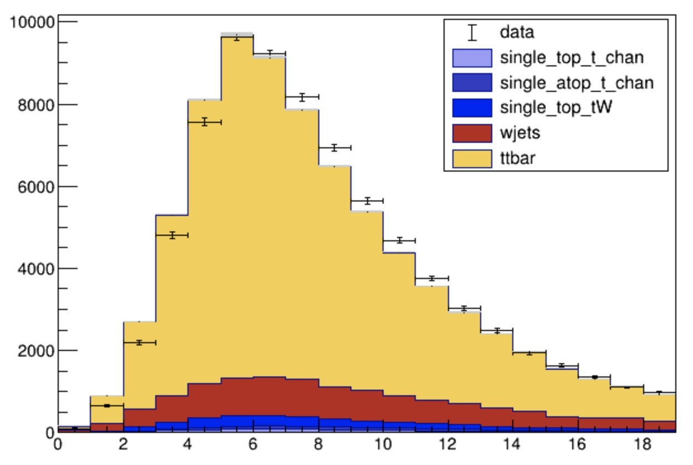
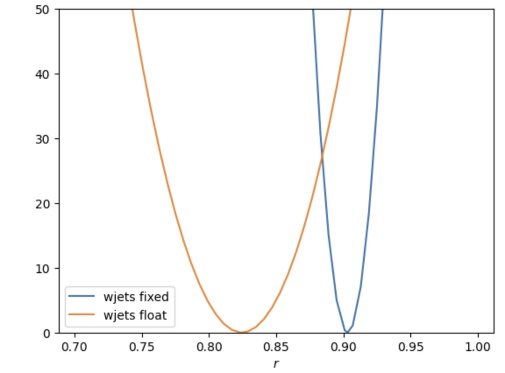
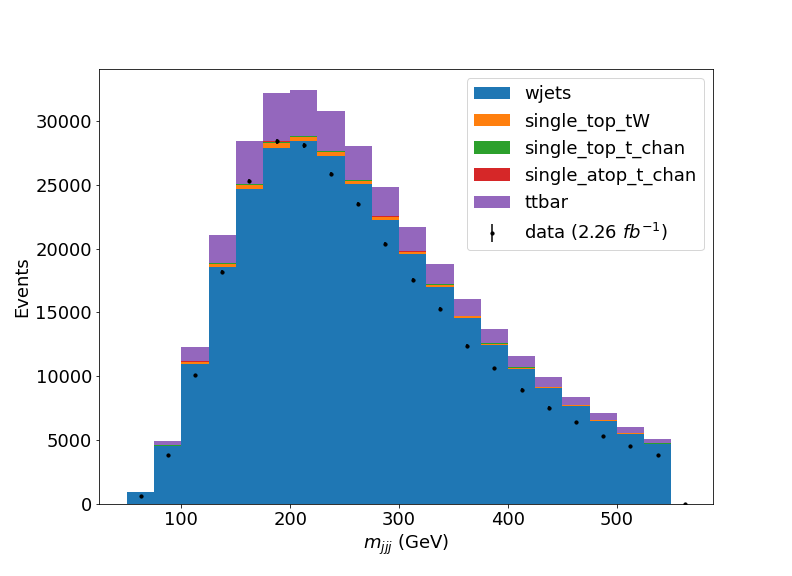

# Exercise 2 - Maximum Likelihood Fits 

From yesterday's exercise, we now have a set of histograms, from data and simulation, in our `.csv` file. Don't worry if you didn't manage to run over all of the samples from yesterday, you can use the pre-prepared file `ttbarAnalysis/exercise1solutions/signalregion_mbjj.csv`.

In today's exercises, we're going to use the CMS statistics software tool `combine` to extract statistical results from the data (and simulation) that we processed yesterday. `combine` is a software package that is designed with a command line interface that uses simple `.txt` files as inputs. You can find out lots more about the tool at the online documentation pages [here](https://cms-analysis.github.io/HiggsAnalysis-CombinedLimit/latest/).

We'll begin by starting the container that has `combine` compiled for us. If you didn't download the container already, go back to the [Getting started](https://nucleosynthesis.github.io/LHCDataStatisticsICISE2024/setup/) pages before continuing. 

To do this, type the following into a terminal on your laptop (or by clicking the play button next to the `cms_combine` container in the Docker desktop application and using the terminal there).

```sh
docker start -i cms_combine
```

Now that we're inside the container, start jupyter lab and enter the URL that gets printed to the screen in your preferred browser. 

```sh
jupyter lab --ip 0.0.0.0 --port 8889 --no-browser
```

## Datacards 

Create a new Text file and give it a name (I called mine `signalregion_mbjj.txt`). This text file will be the input to our `combine` commands - we call it a Datacard. Copy the text below into your text file. 

```
imax 1
jmax 4
kmax 0
# -----------------------------------------------------------------------------------------
shapes data_obs signalregion signalregion_mbjj.csv signalregion:data:nominal,sum_w:sum_ww
shapes *        signalregion signalregion_mbjj.csv signalregion:$PROCESS:nominal,sum_w:sum_ww 
# -----------------------------------------------------------------------------------------
bin         signalregion
observation -1
# -----------------------------------------------------------------------------------------
bin         signalregion  signalregion        signalregion       signalregion   signalregion
process     ttbar         single_atop_t_chan  single_top_t_chan  single_top_tW  wjets
process     0             1                   2                  3              4
rate        -1            -1                  -1                 -1             -1
# -----------------------------------------------------------------------------------------
```

Let's go through these lines and see what they are doing. 

The first lines, specifying `imax`, `jmax` and `kmax` indicate the number of channels, backgrounds and systematic uncertainties, respectively. In our case, we only have one channel (the signal region), and we have four background processes. Right now, we don't have any systematic uncertainties included but later on, we'll add some - for now, we keep this as 0. 

The next lines (starting with `shapes`) say where `combine` will find the distributions (histograms) for the data and the different processes. The first line, 
```
shapes data_obs signalregion signalregion_mbjj.csv signalregion:data:nominal,sum_w:sum_ww
```
says that the shape (distribution or histogram if you like) for the observed data can be found in our `signalregion_mbjj.csv` file in the rows where `process==data` and `systematic==nomial`. The final parts of the line say that the column `sum_w` represents the number of events in each bin. For the data `sum_ww` isn't used but this part of the line is needed for the code to work. 

The next line is very similar 
```
shapes *        signalregion signalregion_mbjj.csv signalregion:$PROCESS:nominal,sum_w:sum_ww 
```
This line is telling `combine` where to find the shapes for the signal and background processes. Here the `*` means that this applies for all of the processes. The keyword `$PROCESS` is expanded for each process that we define in the datacard. This is useful to avoid having to write the same datacard line over and over. 

Next, we have a line that indicates the total numbers of events for the observed data and the different processes in our signal region. 
```
bin         signalregion
observation -1
```
This tells `combine` that there is a channel called `signalregion`. The observation is usually a number but the `-1` there tells `combine` to go and calculate the total number of observed events by summing up the number of events in each bin - this saves us having to write the number each time. 
The next lines are similar, 
```
bin         signalregion  signalregion        signalregion       signalregion   signalregion
process     ttbar         single_atop_t_chan  single_top_t_chan  single_top_tW  wjets
process     0             1                   2                  3              4
rate        -1            -1                  -1                 -1             -1
```

This tells `combine` which processes are expected to contribution to the signal region. The names given should match the names in our `.csv` file so that the `shapes` line above will find the right histograms. Again, we use `-1` for the rate so that `combine` does the calculating for us. Finally, we also give a process ID. Any process with a value $\leq$ will be considered a signal process, while any process with a value $>0$ will be a background process. This is important later when we perform statistical tests. 

## Performing a first fit

Now that we have our Datacard written. We can perform some statistical calculations. We can perform a fit to the data, allowing the total rate of the `ttbar` process to vary. `combine` will automatically create a signal strength parameter - `r` which multiplies the rate of any signal process defined in the datacard. 

We will use the `FitDiagnostics` method to extract the best fit value for the parameter `r` given the data we observed. We do this by typing the following command in a terminal (you can open a terminal in  jupyter lab), 

```sh
combine signalregion_mbjj.txt -M FitDiagnostics
```

You should get something similar to the output below 
```
 --- FitDiagnostics ---
Best fit r: 0.903186  -0.00366585/+0.00367476  (68% CL)
Done in 0.01 min (cpu), 0.01 min (real)
```
You will likely get some warnings about `PDF didn't factorize!` that you can safely ignore for now.

So it looks like the fit would prefer a value of the $tt$ cross-section around 10% smaller than the predicted value that we used when we processed the ttbar sample. You may have a different result if you are using your own `.csv` file. 

Note that you also will now have files called `higgsCombineTest.FitDiagnostics.mH120.root` and `fitDiagnosticsTest.root` that got created from the above command. These files save the result in various ROOT object formats. We will use these  files later on, but for now you can just ignore this file. 

Let's see if our data/simulation agreement has improved after the fit. We can do this by asking combine to create new templates after the fit. We run the command again, but this time, we will add options to save templates with uncertainties to the `fitDiagnosticsTest.root` file. 

```
combine signalregion_mbjj.txt -M FitDiagnostics --saveShapes --saveWithUncert
```

If you are unfamiliar with ROOT, I have created a file called `root2py.py` with some handy functions to read and convert the objects into simple python arrays that can be used for plotting with matplotlib. Below is an example (written in pyROOT or just python) to make a plot of the distributions after the fit. You can copy either of these 

=== "python"

    ``` python
    from root2py import *
    import ROOT 

    file   = ROOT.TFile.Open("fitDiagnosticsTest.root")
    folder = file.Get("shapes_fit_s/signalregion")

    results = getHistogramCountsAndData(folder)

    import matplotlib.pyplot as plt

    nsamples    = len(results['samples'])
    bin_centres = results['data'][0]
    bins_list   = [results['samples'][i][1][0][0:-1] for i in range(nsamples)]
    bin_boundaries = results['samples'][0][1][0]
    samples_stack = [results['samples'][i][1][1] for i in range(nsamples)]
    labels        = [results['samples'][i][0] for i in range(nsamples)]
    data_errs     = [results['data'][2],results['data'][3]]

    plt.hist(bins_list,bins=bin_boundaries,weights=samples_stack,label=labels,stacked=True,density=False)
    plt.errorbar(bin_centres,results['data'][1]
                 ,yerr=data_errs
                 ,label='data'
                 ,marker='o'
                 ,markersize=4.0
                 ,color='black'
                 ,linestyle="none")

    # calculate min and max from total errors on prediction for filled area
    # we need to add left most and right most bin edge for this to work 

    totalED = results['total'][1]-results['total'][2]
    totalEU = results['total'][1]+results['total'][2]

    totalED = np.insert(totalED,0,totalED[0])
    totalED = np.append(totalED,totalED[-1])

    totalEU = np.insert(totalEU,0,totalEU[0])
    totalEU = np.append(totalEU,totalEU[-1])

    bin_centres_x = np.insert(bin_centres,0,0)
    bin_centres_x = np.append(bin_centres_x,len(bin_centres))

    plt.fill_between(bin_centres_x,totalED,totalEU,color='gray',alpha=0.25,step='mid')
    plt.ylim(0,1.3e4)
    plt.legend()
    ```

=== "pyROOT"

    ```python
    import ROOT

    canvas = ROOT.TCanvas()

    file   = ROOT.TFile.Open("fitDiagnosticsTest.root")
    folder = file.Get("shapes_fit_s/signalregion")

    data  = folder.Get("data")
    print(data.GetN())
    total = folder.Get("total"); total.SetFillColor(ROOT.kGray)

    ttbar = folder.Get("ttbar") ; ttbar.SetFillColor(ROOT.kOrange) ; ttbar.SetFillStyle(1001)
    wjets = folder.Get("wjets") ; wjets.SetFillColor(ROOT.kRed+1)
    single_top_tW = folder.Get("single_top_tW") ; single_top_tW.SetFillColor(ROOT.kBlue)
    single_atop_t_chan = folder.Get("single_atop_t_chan"); single_atop_t_chan.SetFillColor(ROOT.kBlue-3)
    single_top_t_chan  = folder.Get("single_top_t_chan"); single_top_t_chan.SetFillColor(ROOT.kBlue-9)

    # create legend and stack and fill them
    legend = ROOT.TLegend(0.6,0.6,0.89,0.89)
    legend.AddEntry(data,"data","pe")

    stk = ROOT.THStack("stack",";;Events")
    stk.Add(single_top_t_chan); legend.AddEntry(single_top_t_chan,"single_top_t_chan","F")
    stk.Add(single_atop_t_chan); legend.AddEntry(single_atop_t_chan,"single_atop_t_chan","F")
    stk.Add(single_top_tW); legend.AddEntry(single_top_tW,"single_top_tW","F")
    stk.Add(wjets); legend.AddEntry(wjets,"wjets","F")
    stk.Add(ttbar); legend.AddEntry(ttbar,"ttbar","F")

    #data.Draw("ApE")
    stk.Draw("hist")
    data.Draw("pE")
    #ttbar.Draw("histsame")
    total.Draw("E2same")
    legend.Draw()
    canvas.Draw()
    ```

!!! tip "Challenge"
    Add a ratio panel below the main plot that shows data/total expected. This can be a good way to judge more easily by eye how well the data and predictions agree after the fit. 

## Adding additional rate modifiers 
The agreement looks a little better than before but we could still do better. We should also allow our dominant background process (`wjets`) to float so that the fit can adjust the total rate. 

Add the following line to your Datacard, 
```
wjets_norm rateParam signalregion wjets 1 [0,5]
```

This line tells combine to add a new parameter to the model that multiplies the rate of the specified process, in the specified channel. The new parameters will be `wjets_norm`, which multiplies the rate of the `wjets` process. We've chosen the default value of the parameter to be 1 and allowed its range to vary between 0 and 5. 

!!! Question 
    Run the `-M FitDiagnostics` method again and plot the new best fit shapes. Does the agreement improve compared to before? What are the values of the fitted rate multipliers (add the option `-v 3` to get combine to print this information).

/// details | Show answer
By running
```
combine signalregion_mbjj.txt -M FitDiagnostics -v 3 --saveShapes --saveWithUncert
``` 
we now find in the output 
```
r          = 0.824465     +/-  0.0115119 (limited)
wjets_norm = 2.45416      +/-  0.203045  (limited)
```
Now we see that the fit would prefer to scale up the `wjets` process by a factor of ~2.45 compared to our original prediction. The best-fit value for the signal strength has also changed from what we saw before. 

If we look at a plot of the fit results we can see things are a little improved. The plot below is made using the pyROOT version of our plotting code. 



Remember, your results might be different if you're using your own solution from the first exercise. 
///

You may have noticed that in addition to the best fit value, `combine` reports an uncertainty `+/-`. We will cover what we mean by uncertainty in the lectures, but this uncertainty is estimated by using the inverse of the Hessian matrix from the fit result. From this alone, we can see that by including an additional parameter, the uncertainty on our best fit for `r` has increased. Generally, we expect that adding freedom to the fit will increase the uncertainty of our results but improve the overall agreement in our data/simulation plots.  

We can estimate this uncertainty more accurately by scanning the *profiled log-likelihood* and comparing this for the two cases; with and without the `wjets_norm` parameter. 

## Likelihood scans

Remember in the lectures, we define a quantity $q(r)$ as the following, 

$$
q(r) = -2\ln \frac{L(r,\hat{\nu}_{r})}{L(\hat{r},\hat{\nu})}
$$

where the $\hat{\cdot}$ notation means the maximum likelihood estimate (or best-fit) and the subscript and where $\nu$ represents our nuisance parameters. In this case, we only have one such nuisance parameter which is `wjets_norm`. The value $\hat{\nu}_{r}$ is the value of $\nu$ for that maximises the likelihood when $r$ is fixed to a specific value - sometimes we call this the conditional maximum likelihood. 

`combine` can calculate this quantity as a function of our parameter $r$ using the `-M MultiDimFit` method and the `grid` algo with the command, 

```
combine signalregion_mbjj.txt -M MultiDimFit --algo grid --points 50 --setParameterRanges r=0.7,1
```

The option `--points` tells combine how many evenly spaced points at which to evaluate the function $q(r)$ and the last option specifies the range that those points should be in. After running this command, there will be a new ROOT file called `higgsCombineTest.MultiDimFit.mH120.root` in your file browser. 

!!! Warning 
    If you run the `combine` command twice, the output file will be overwritten. By adding the option `-n name`, you can avoid this as the word `Test` will be modified to `name` that you specify. Use this to keep track of different results.  

This file contains a `TTree` that stores the values of $r$ and $0.5\times q(r)$ in its branches. In the python file `root2py.py` I have included a function to convert these into python arrays for you. You can plot the value of $q(r)$ using one of the blocks of code below, depending on if you prefer pyROOT or straight python. 


=== "python"
    ```python
    from root2py import *
    import ROOT
    fscan = ROOT.TFile("higgsCombineTest.MultiDimFit.mH120.root")
    tree  = fscan.Get("limit")
    x,y = get2DeltaNLLScan(tree)
    plt.plot(x,y) 
    ```

=== "pyROOT"
    ```python
    import ROOT
    fscan = ROOT.TFile("higgsCombineTest.MultiDimFit.mH120.root")
    tree  = fscan.Get("limit")
    canvas = ROOT.TCanvas()
    tree.Draw("2*deltaNLL:r","","L")
    canvas.Draw()
    ```

!!! Question
    Make a plot of $q(r)$ for the case where the rate of `wjets` is allowed to float and where it is fixed to the original value, on the same axis. Which one is wider? What does that tell us?

/// details | Show answer
You should find something like the plot below by using the code provided above and modifying to plot two scans on top of one another. 



The scan where the rate of `wjets` is allowed to float is much wider than the original scan. 
///

!!! tip "Challenge"
    To estimate the uncertainty, we can define confidence intervals, according to Wilks' theorem, as the region for which $q(r)< x_{\alpha}$ where $\alpha$ is our test size. For $1-\alpha=0.683$, i.e a 68.3% confidence interval, $x_{\alpha}=1$. Find the 68.3% intervals for each of the scans using this method. 

## Goodness-of-fit 

Instead of comparing our data/simulation plots by eye, we can use a measure of the Goodness-of-fit. In lectures we learned about hypothesis testing. `combine` has several routines for calculating a goodness-of-fit, but we will just use the so called `saturated` test for an idea of the fit quality. 

The test-statistic for a template model is, 

$$
    t = -2\ln\frac{L(\hat{r},\hat{\theta})}{L_{s}}
$$
where $L_{s}$ is the *saturated likelihood*. It is defined as the likelihood valye where the expected value in each bin is exactly the same as the observed value - i.e the very largest possible likelihood value given the data observed. 

We can calculate this value with `combine` using the following, 
```sh
combine signalregion_mbjj.txt -M GoodnessOfFit --algo=saturated
```

A result in the literature (Wilks' theorem) tells us that for large statistics samples (in the asymptotic limit), this test statistic will be distributed according to a $\chi^{2}$ distribution with $n$ degrees of freedom where $n$ is the number of bins in the distribution minus the number of parameters in the fit - in our case this is $n=20-2=18$. This means, we can convert the number calculated by combine to a $p$-value using, 

$$
p = \int_{t}^{+\infty} \chi^{2}(n)dt 
$$

or in code form using the function below 
```
import ROOT 
ROOT.TMath.Prob(t,18)
```

!!! Question
    Calculate the $p$-value for both cases (with and without the `wjets_norm` parameter). Which one is better? 

/// details | Show answer
You should find a very very small value in both cases so both fits are pretty awful. 
///

!!! tip "Challenge" 
    In the `combine` online documentation, on [Goodness of fit tests](https://cms-analysis.github.io/HiggsAnalysis-CombinedLimit/latest/part3/commonstatsmethods/#goodness-of-fit-tests), you can find instructions for calculating $p$-values using toys rather than relying on asymptotic methods. Calculate the $p$-values for the two cases using the saturated algorithm.


## Control regions

In the previous examples we saw that we can trade between sensitivity in our measurement (the uncertainty in `r`) and quality of the fit result. In an ideal world, we would have a good overall quality of the fit and a reasonably small uncertainty in our results. 

We saw that the fit improved when allowing the rate of `wjets` to float in the fit, but at the cost of increased uncertainty in `r`. We can improve this by constraining the parameter `wjets_norm` using a control region. 

A control region is another region in the data that is dominated by a particular background process. By including this region in the fit, we will be able to use that additional data to constrain the `wjets_norm` parameter. 

Let's go back to the `cms_python` container and modify our analysis notebook to create a control region that will be dominated by the `wjets` process. If you didn't manage to get a working analysis yesterday, you can use the notebook provided `ttbarAnalysis/exercise1solutions/FullAnalysis.ipynb`. 

We need to change how we are filtering our events, we want to modify the selection so that we choose events with no b-tagged jets but everything else is the same, i.e change,   

```
(ak.sum(selected_jets.btag >= 0.8, axis=1) >= 2)
```
to 
```
(ak.sum(selected_jets.btag >= 0.8, axis=1) < 1)
```

Our observable will be different now since we no longer want to pick the trijet with a b-quark. Instead we just use the trijet with the largest $p_{T}$, i.e we change the observable calcualtion to 
```
trijet = ak.combinations(selected_events_CR, 3, fields=["j1", "j2", "j3"])
j1,j2,j3 = ak.unzip(trijet)
trijet["p4"] = trijet.j1 + trijet.j2 + trijet.j3
trijet_mass = trijet["p4"][ak.argmax(trijet.p4.pt, axis=1, keepdims=True)].mass
observable = ak.flatten(trijet_mass).to_numpy()
```
for the control region. We will use this control region in combination with our signal region in tomorrow's exercise. 

!!! Question 
    Write a new notebook to process the events but this time applying the control region selection. 
    If you prefer, you can instead modify your original notebook so that it can process the events for the signal region and control region at the same time! Remember, 
       - Also modify the name of the output file to something like `controlregion_mbjj.csv` so as not to overwrite our signal region. 
       - You should name the channel for the control region something like "`controlregion`" as we'll use this name for our datacards later - remember this when using the `histogramToDataframe` function. 
       - We also want to include the histograms for the jes up and down variations just like we did in the control region. 

/// details | Show answer
I have uploaded a Jupyter notebook that will perform the  analysis on the samples and produce both the signal region and control region in a single output `.csv` called `allregions.csv`. The notebook os called `FullAnalysisWithControlRegion.ipynb`in the `ttbarAnalysis` folder. If you really get stuck, have a look at this notebook to see how to run our object and event selection, calculate the observable and save the histograms for all of the samples this time with the control region. 

The distributions in the control region should look something like the plot below 


///
