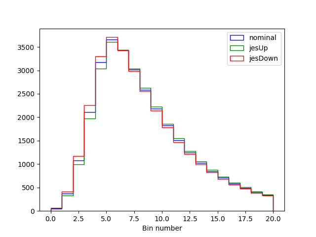
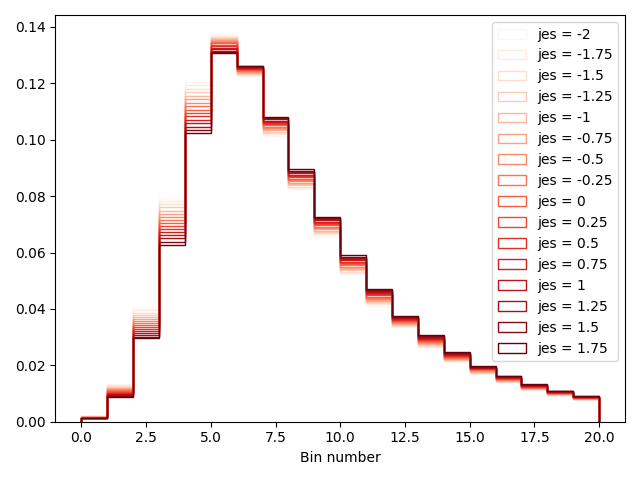
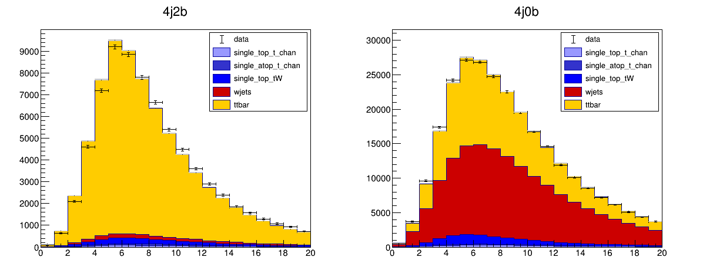
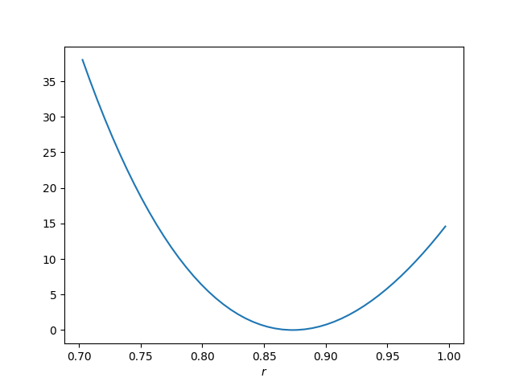

# Exercise 3 - Control Regions and Systematic Uncertainties

Launch the `cms_combine` container by typing the following into a terminal on your laptop (or by clicking the play button next to the cms_combine container in the Docker desktop application and using the terminal there).
```sh
docker start -i cms_combine
```

In today's exercise, we are going to use our 4j0b control region that we populated at the end of exercise 2 to constrain our `wjets` process in our 4j2b signal region. Don't worry if you didn't manage to process the samples to create the histograms for the 4j0b region. I have put a `.csv` file  `exercise2solutions/allregions_mbjj.csv` that has both the signal region and control region histograms for you. You'll also find the datacard for the signal region in the same folder: `signalregion_mbjj.txt`. 

## Control region datacard 

First, we need to create a new datacard for our 4j0b control region. This will look very similar to our signal region datacard except that we need to change the name of the channel and point to the right histograms in the file. Copy the text below into a new text file, i've called mine `controlregion_mjjj.txt`

```
imax 1
jmax 4
kmax 0
# -----------------------------------------------------------------------------------------
shapes data_obs controlregion allregions_mbjj.csv controlregion:data:nominal,sum_w:sum_ww
shapes *        controlregion allregions_mbjj.csv controlregion:$PROCESS:nominal,sum_w:sum_ww 
# -----------------------------------------------------------------------------------------
bin         controlregion
observation -1
# -----------------------------------------------------------------------------------------
bin         controlregion controlregion       controlregion      controlregion  controlregion
process     ttbar         single_atop_t_chan  single_top_t_chan  single_top_tW  wjets
process     0             1                   2                  3              4
rate        -1            -1                  -1                 -1             -1
# -----------------------------------------------------------------------------------------
wjets_norm rateParam controlregion wjets 1 [0,5]
```

Notice how the `shapes` lines are now pointing to the `controlregion` histograms in the `allregions_mbjj.csv` file. The names of the channel everywhere has also changed to `controlregion`. This tells combine that this data are independent from the data in our signal region. Finally, the last line of the datacard, 
```
wjets_norm rateParam controlregion wjets 1 [0,5]
```
tells combine to create a parameter called `wjets_norm` that modifies the rate of the `wjets` process in the `controlregion`. By naming this parameter the same as the one in our signal region datacard, this parameter will simultaneously scale the `wjets` process in both regions!

Now we need to create a single datacard that contains the information for both the signal region and the control region. We do not need to do this by hand since the package comes with a tool that does this for us. To create combined datacard, we can run the following, 

```sh
combineCards.py signalregion=signalregion_mbjj.txt controlregion=controlregion_mjjj.txt > combined.txt 
```

Let's look at the resulting datacard (below)
```
Combination of signalregion=signalregion_mbjj.txt  controlregion=controlregion_mjjj.txt
imax 2 number of bins
jmax 4 number of processes minus 1
kmax 0 number of nuisance parameters
----------------------------------------------------------------------------------------------------------------------------------
shapes *              controlregion  allregions_mbjj.csv controlregion:$PROCESS:nominal,sum_w:sum_ww
shapes data_obs       controlregion  allregions_mbjj.csv controlregion:data:nominal,sum_w:sum_ww
shapes *              signalregion   allregions_mbjj.csv signalregion:$PROCESS:nominal,sum_w:sum_ww
shapes data_obs       signalregion   allregions_mbjj.csv signalregion:data:nominal,sum_w:sum_ww
----------------------------------------------------------------------------------------------------------------------------------
bin          signalregion   controlregion
observation  -1             -1           
----------------------------------------------------------------------------------------------------------------------------------
bin          signalregion        signalregion        signalregion        signalregion        signalregion        controlregion       controlregion       controlregion       controlregion       controlregion     
process      ttbar               single_atop_t_chan  single_top_t_chan   single_top_tW       wjets               ttbar               single_atop_t_chan  single_top_t_chan   single_top_tW       wjets             
process      0                   1                   2                   3                   4                   0                   1                   2                   3                   4                 
rate         -1                  -1                  -1                  -1                  -1                  -1                  -1                  -1                  -1                  -1                
----------------------------------------------------------------------------------------------------------------------------------
wjets_norm    rateParam signalregion wjets 1 [0,5]
wjets_norm    rateParam controlregion wjets 1 [0,5]
```

We now see that all of the information has been combined into a single datacard! at the top of the datacard, we see that the datacard is a result of the *combination* of our two original datacards, and the numbers `imax`, `jmax` and `kmax` have automatically been updated for us. 

!!! Warning
    In the combined datacard, both the signal region and control region histograms are taken from the same file `allregions_mbjj.csv`, this is because I have changed the `shape` lines in my signal region datacard to read 
    ```
    shapes data_obs signalregion allregions_mbjj.csv signalregion:data:nominal,sum_w:sum_ww
    shapes *        signalregion allregions_mbjj.csv signalregion:$PROCESS:nominal,sum_w:sum_ww 
    ```
    You do not have to do this if you created the signal region and control region histograms in separate `.csv` files. 

This datacard can now be used as the input to out `combine` commands to perform fits and calculate uncertainties as we did when we only had a single datacard. 

!!! Question 
    Run the fit diagnostics method on the combined datacard to calculate the best fit value for the signal strength parameter `r`. How does this compare to the two results we obtained with a single datacard? Make a plot of the post-fit distributions and the data in the two regions from this new fit. Remember to add the option `-n name` to create a different name for the output file to avoid writing over your original outputs from combine.  

/// details | Show answer
We can run the same commands as before, but this time we provide the combined datacard as the input. For the best fit,
```sh
combine combined.txt -M FitDiagnostics --saveShapes --saveWithUncert -n Combined
```
with the result as, 
```
--- FitDiagnostics ---
Best fit r: 0.917371  -0.00376498/+0.00377766  (68% CL)
```
The result and uncertainty is much closer to the version of the datacard without the freely floating `wjets_norm` parameter. This means we've successfully managed to recover the constraint on the `wjets_norm` parameter by using the data in the 4j0b control region!
You can use the same code from Exercise 2 to plot each of the regions from the result file `fitDiagnosticsCombined.root`
///

## Systematic Uncertainties

In our fits so far, we have assumed that the distributions and rates determined from the simulated events represent perfectly what we would expect to see in data. Of course, reality is never quite that easy and every step of any real data analysis will involve some assumption about how well we can model a particular effect. Each of these assumptions comes with some uncertainty and these uncertainties impact the predicted yields and distributions - we call them "systematic uncertainties". These could range from uncertainties in the theoretical cross-sections used to normalise the samples, uncertainties in the efficiency of the trigger or event selection, energy scale and other calibrations used to reconstruct the particles or even the uncertainty on the integrated luminosity of our data set!

The vast majority of the time spent doing a real LHC data analysis is carefully understanding which uncertainties effect any particular measurement and how large they are. Often, a lot of work is put into reducing these uncertainties (or rather their effect on the measurement) as much as possible to get the best measurements from the data. We don't have time in these exercises to properly calculate the effects of all the different systematic uncertainties that we should consider, but we will take a look at a few simple ones and include them in our analysis. 

In likelihood based methods (mostly what we use at the LHC), systematic uncertainties are included via nuisance parameters and auxiliary observables that can have different distributions. 

### Rate uncertainties 

The simplest form of systematic uncertainties are those that affect the overall predicted rate of a given process. We typically model rate uncertainties using the log-normal distribution. In `combine` this is implemented by multiplying the rate of a given process by a multiplicative factor, 

$$
f(\nu) = \kappa^{\nu}
$$

where $\nu$ is the associated nuisance parameter and $\kappa$ is the *size of the effect* of the uncertainty on a particular process. In `combine` an additional gaussian probability term in the likelihood gets included. This means that since the likelihood estimator $\hat{\nu}$ is normal distributed, $f(\hat{\nu})$ will be log-normal distributed (hence the name). As we saw in lectures, the practical reason why we use log-normals is that $f$ can never be negative, which makes sense for a rate. 

Add the following lines to your signal region datacard, 

```
lumi  lnN   1.023        1.023                1.023              1.023          - 
ideff lnN   1.01         1.01                 1.01               1.01           - 
btag  lnN   1.03         1.03                 1.03               1.03           1.03 
```

Each of these lines tells `combine` that we have a new rate systematic uncertainty. Lets take a look at the first one of these `lumi`. The first parts of the line give the nuisance parameter parameter its name - `lumi` and its type `lnN` means its log-normal. The numbers represent the value of $\kappa$ for each process in our signal region. An uncertainty in the integrated luminosity measurement will scale all of the simulated processes up/down by the same amount - in our 2015 data, the uncertainty in the luminosity measurements was 2.3% so $\kappa$ is 1.023. 

If the parameter `lumi` is set to +1, the value of $f$ will be 1.023 so all of the processes will increase by a factor 1.023. Similarly, if the parameter `lumi` is set to -1, the value of $f$ will be 1.023 so all of the processes will change by 1/1.023 (decrease). 

Our `wjets` normalisation is determined by the fit - i.e from the data in the control region - so the luminosity systematic uncertainty should have no effect. In `combine` this is indicated by putting a "`-`" instead of a value. The next line `ideff` is exactly the same, except it is the systematic uncertainty for the muon/electron identification efficiency measurements and is 1%. 

The third line is for the b-tagging efficiency, and the uncertainty has an effect of 3% in the signal region. In the control region however, since we are rejecting b-jets, the effect of the uncertainty should be opposite (anti-correlated) to the signal region. In `combine` we achieve this by setting $\kappa < 1$.

!!! Question 
    If the b-jet tagging efficiency increases the rate in the signal by 3%, what should the values of $kappa$ be in the control region? Remember the effect should be opposite to the signal region and that since there is about 3 times as many events in the signal region as the control region, increasing the number of events that pass the b-tag (in our 4j2b region) by 3% will not result in a reduction of 3% events that fail the b-tag (in the 4j0b region). Add the systematic uncertainty lines for the `lumi`, `ideff` and `btag` to your control region datacard. 

/// details | Show answer
The number should be $\kappa=0.99$ in the control region. This is because adding 3% of the yield in the signal region to the control region would increase the control region yield by 1% since there's already 3 times as much data there. The rate uncertainty lines in the datacard for the control region should look like, 
```
lumi  lnN   0.023        0.023                0.023              0.023          - 
ideff lnN   1.01         1.01                 1.01               1.01           - 
btag  lnN   0.99         0.99                 0.99               0.99           0.99 
```
///

Notice that for the `btag` uncertainty, there should be an entry for the `wjets`. This is because this  uncertainty has a different effect in the signal and control regions. 

### Shape uncertainties 

Some uncertainties in will affect both the overall rate of a particular process *and its shape*. For these uncertainties, we need to provide alternative histograms that represent the shape of a process when we vary some aspect of our model up and down. Remember, when we created our `.csv` files, we created histograms where we shifted the jet energy scale up and down by its uncertainty, resulting from uncertainties in the jet calibrations. Let's take a look at these distributions for the `ttbar` process. You can use the following code in a notebook to plot these distributions, 

```
import matplotlib.pyplot as plt 
import pandas as pd 

df = pd.read_csv("allregions_mbjj.csv")

df = df[ (df.channel=='controlregion') & (df.process=='ttbar') ]
bins = df[df.systematic=='nominal']['bin']
print(len(bins))
plt.hist(bins,bins=bins
         ,weights=df[df.systematic=='nominal']['sum_w']
         ,histtype='step'
         ,color='blue'
         ,label='nominal')
plt.hist(bins,bins=bins
         ,weights=df[df.systematic=='jesUp']['sum_w']
         ,histtype='step'
         ,color='green'
         ,label='jesUp')
plt.hist(bins,bins=bins
         ,weights=df[df.systematic=='jesDown']['sum_w']
         ,histtype='step'
         ,color='red'
         ,label='jesDown')
plt.legend()
plt.xlabel("Bin number")
```

Which will produce a figure similar to the one below, 



We can see that when the jet energy scale is increased, the observable distribution shifts to the right, while when it is decreased, the observable distribution shifts to the left! This uncertainty will change our prediction of what the `ttbar` shape looks like (and in fact the other processes too). 

We need to tell `combine` about these histograms to create shape systematic uncertainties. First, we need to extend the `shapes` lines in the datacards to point to these histograms. We do this by modifying the `shapes` line of our `signalregion_mbjj.txt` datacard to read 
```
shapes *        signalregion allregions_mbjj.csv signalregion:$PROCESS:nominal,sum_w:sum_ww signalregion:$PROCESS:$SYSTEMATIC,sum_w:sum_ww 
```
Notice how there is a new part at the end of the line with `$SYSTEMATIC`. This tells `combine` that each shape systematic uncertainty templates can be found in the same `.csv` file but will correspond to the column `systematic==SYSTEMATICUp` and `systematic==SYSTEMATICDown`. The value of `SYSTEMATIC` is determined from each of the shape uncertainty lines we add at the end of the datacard. We have only one which we called `jes` so we just need to add the following line to our signal region datacard, 

```
jes   shape     1          1           1            1            1
```

This line tells `combine` to create a nuisance parameter for our shape uncertainty with the name `jes`. Each number indicates how big the variation that templates corresponds to is, for each process. The value `1` means that each alternate histogram corresponds to a 1-sigma variation. If we put a `-` it would mean there is no effect for this process. 

We also need to add the same to our control region datacard since the same source of uncertainty (and hence the same parameter) will simultaneously modify the shapes of our processes in the 4j0b and 4j2b regions. 

!!! Question 
    Extend the `shapes` lines in the control region datacard and add the systematic uncertainty line in the control region datacard too. 

/// details | Show answer
First, we need to modify the `shapes` lines in the control region datcard as follows, 
```
shapes *  controlregion allregions_mbjj.csv controlregion:$PROCESS:nominal,sum_w:sum_ww controlregion:$PROCESS:$SYSTEMATIC,sum_w:sum_ww 
```
similarly to what was done in the signal region. We also need to include the line that tells `combine` to create a shape uncertainty for the `jes` parameter at the end of the datacard, 
```
jes   shape   1         1          1          1           1
```
/// 

`combine` will create a new parameter, called `jes` and interpolate each bin of the histogram so that the histogram shape becomes a function of `jes`. The interpolating function is designed to be differentiable and so that we retrieve the nominal shape when `jes=0`, the `jesUp` shape when `jes=1` and the `jesDown` shape when `jes=-1`. 

First, let's build the statistical model for the signal region datacard, 

```sh
text2workspace.py signalregion_mbjj.txt -o signalregion_mbjj.root
```

Using the code below, we can plot the distribution of the `ttbar` process as we vary the `jes` parameter value, 

=== "python"
    ```python 
    from root2py import *
    import ROOT
    import numpy as np

    file   = ROOT.TFile.Open("signalregion_mbjj.root ")
    workspace = file.Get("w")

    hists = []
    jes_vals = np.arange(-2,2,0.25)
    for jes_val in jes_vals:
      workspace.var("jes").setVal(jes_val)
      hist = workspace.pdf("shapeSig_signalregion_ttbar_morph").createHistogram("CMS_th1x")
      hist.SetName("hist_%g"%jes_val)
      hists.append(hist)

    import matplotlib.pyplot as plt
    import matplotlib.colors as mcolors
    import matplotlib.cm as cm

    normalize = mcolors.Normalize(vmin=jes_vals.min(), vmax=jes_vals.max())
    colormap = cm.Reds

    for i,jes_val in enumerate(jes_vals):
        h = hists[i]
        rx,ry,ey = readHist(h)
        plt.hist(rx[0:-1],bins=rx,weights=ry
                ,histtype='step',label='jes = %g'%jes_val
                ,color=colormap(normalize(jes_val)))

    plt.xlabel("Bin number")
    plt.legend()
    plt.tight_layout()
    ```

=== "pyROOT"
    ```python
    import ROOT
    import numpy as np

    file   = ROOT.TFile.Open("signalregion_mbjj.root ")
    workspace = file.Get("w")

    hists = []
    jes_vals = np.arange(-2,2,0.25)

    for jes_val in jes_vals:
      workspace.var("jes").setVal(jes_val)
      hist = workspace.pdf("shapeSig_signalregion_ttbar_morph").createHistogram("CMS_th1x")
      hist.SetName("hist_%g"%jes_val)
      hists.append(hist)

    ROOT.gStyle.SetOptStat(0)
    c = ROOT.TCanvas()
    leg = ROOT.TLegend(0.6,0.3,0.89,0.89)
    leg.SetBorderSize(0)

    for i,jes_val in enumerate(jes_vals):
        hists[i].SetTitle("")
        hists[i].GetXaxis().SetTitle("Bin Number")
        hists[i].GetYaxis().SetTitle("")
        hists[i].SetLineWidth(2)
        if i==0: hists[i].Draw("PLC")
        else: hists[i].Draw("histsame PLC")
        leg.AddEntry(hists[i],"jes = %g"%jes_val,"L")
        color+=1

    leg.Draw()
    c.Draw()
    ```

This will give a figure similar to the following, 



### Monte-carlo (MC) statistics uncertainties. 

Finally, we also need to account for the fact that our simulated samples (Monte-carlo or MC) have a limited number of events available to create the histograms. This leads to a statistical uncertainty on the histograms that are used in the fits. `combine` can take care of these for us by using the `sum_ww` column that we included in our dataframes. We just need to add the following line to the datacard, 
```
signalregion autoMCStats 0
```
The first part indicates which control region to consider and the `0` at the end is used to determine how the calculation is done (this is very technical ut if you want to find out about this you can read about it [here](https://cms-analysis.github.io/HiggsAnalysis-CombinedLimit/latest/part2/bin-wise-stats/)). 

!!! Question 
    Add the relevant line to the control region datacard to account for the MC statistical uncertainties. 

/// details | Show answer
We just need to add the following line to the `controlregion_mjjj.txt` datacard, 
```
controlregion autoMCStats 0
```
///

Finally, we should make sure the `kmax` line in our datacards is adjusted to reflect the total number of systematic uncertainties. We do not count the `autoMCStats` line so we shoud set `kmax` to 4 in each datacard. 

## Putting it all together

Now we have everything in place for the control region and systematic uncertainties, we should re-run the fit and extract the uncertainty on our measured signal rate `r`. 

!!! Question 
    
    1. Run the `FitDiagnostics` method on the combination of the signal and control region and create a plot of the best fit for both regions.

    2. Determine the best fit parameter values. 

        
    3. Calculate the $\chi^{2}$ from the best fit model. 

    4. Perform a profiled likelihood scan of the signal strength `r` and plot it. 

    For 2. you can use the code below to print out the fit results. 
    === "python"
        ```python
        from root2py import *
        import ROOT
        file   = ROOT.TFile.Open("fitDiagnosticsCombined.root")
        fit_res = convertFitResult(file.Get("fit_s"))
        print(fit_res)
        ```

    === "pyROOT"
        ```python
        import ROOT
        file   = ROOT.TFile.Open("fitDiagnosticsCombined.root")
        fit_res = file.Get("fit_s")
        fit_res.Print()
        ```


!!! Warning
    You may find that you get some errors in these steps related to the fit result. I advise you to add the `--cminDefaultMinimizerStrategy 0` to your `combine` commands. 

/// details | Solution
1. First we should create a new combined card with, 
```sh
combineCards.py signalregion=signalregion_mbjj.txt controlregion=controlregion_mjjj.txt > combined.txt
```
Next, we run the fit, 
```sh
combine combined.txt -M FitDiagnostics --skipB -n Combined --cminDefaultMinimizerStrategy 0 --saveShapes --saveWithUncert 
``` 
Using the output file we can find the results of the fit and also make plots of the. It should look something like the figure below, 


2. Using the code provided, we get the following output (you should see something similar), 
```
  Floating Parameter    FinalValue +/-  Error   
  --------------------  --------------------------
                  btag    2.1634e+00 +/-  8.54e-01
                 ideff    4.6681e-01 +/-  1.02e+00
                   jes    7.7198e-01 +/-  6.09e-02
                  lumi   -3.7650e-01 +/-  1.01e-02
  prop_bincontrolregion_bin0    7.9891e-01 +/-  8.83e-01
  prop_bincontrolregion_bin1    2.1593e+00 +/-  9.00e-01
  prop_bincontrolregion_bin10   -1.3274e-01 +/-  9.10e-01
  prop_bincontrolregion_bin11    5.6041e-01 +/-  9.08e-01
  prop_bincontrolregion_bin12   -1.1857e+00 +/-  9.12e-01
  prop_bincontrolregion_bin13   -4.7468e-01 +/-  9.10e-01
  prop_bincontrolregion_bin14   -2.6136e-01 +/-  9.08e-01
  prop_bincontrolregion_bin15   -7.2318e-01 +/-  9.09e-01
  prop_bincontrolregion_bin16   -4.2696e-02 +/-  9.06e-01
  prop_bincontrolregion_bin17   -1.1439e+00 +/-  9.09e-01
  prop_bincontrolregion_bin18   -4.3565e-01 +/-  9.08e-01
  prop_bincontrolregion_bin19   -9.3066e-02 +/-  9.03e-01
  prop_bincontrolregion_bin2    2.2050e+00 +/-  9.14e-01
  prop_bincontrolregion_bin3    2.1998e+00 +/-  9.19e-01
  prop_bincontrolregion_bin4    1.1193e+00 +/-  9.31e-01
  prop_bincontrolregion_bin5   -1.2407e+00 +/-  9.34e-01
  prop_bincontrolregion_bin6   -8.1615e-01 +/-  9.26e-01
  prop_bincontrolregion_bin7   -7.9343e-01 +/-  9.15e-01
  prop_bincontrolregion_bin8    1.1287e-01 +/-  9.13e-01
  prop_bincontrolregion_bin9   -1.7256e-01 +/-  9.11e-01
  prop_binsignalregion_bin0   -4.3051e-01 +/-  9.76e-01
  prop_binsignalregion_bin1   -8.8268e-01 +/-  9.84e-01
  prop_binsignalregion_bin10    6.6384e-01 +/-  9.85e-01
  prop_binsignalregion_bin11    5.6890e-01 +/-  9.84e-01
  prop_binsignalregion_bin12    5.6803e-01 +/-  9.83e-01
  prop_binsignalregion_bin13    5.8144e-01 +/-  9.82e-01
  prop_binsignalregion_bin14    2.1825e-01 +/-  9.82e-01
  prop_binsignalregion_bin15    5.5108e-01 +/-  9.82e-01
  prop_binsignalregion_bin16    4.5671e-01 +/-  9.81e-01
  prop_binsignalregion_bin17    5.1578e-01 +/-  9.79e-01
  prop_binsignalregion_bin18    6.7096e-01 +/-  9.79e-01
  prop_binsignalregion_bin19    2.1684e-01 +/-  9.81e-01
  prop_binsignalregion_bin2   -1.0313e+00 +/-  9.86e-01
  prop_binsignalregion_bin3   -6.6500e-01 +/-  9.87e-01
  prop_binsignalregion_bin4   -9.7874e-01 +/-  9.89e-01
  prop_binsignalregion_bin5   -5.2094e-01 +/-  9.88e-01
  prop_binsignalregion_bin6   -2.9065e-01 +/-  9.88e-01
  prop_binsignalregion_bin7    1.5923e-01 +/-  9.87e-01
  prop_binsignalregion_bin8    5.5739e-01 +/-  9.87e-01
  prop_binsignalregion_bin9    4.2686e-01 +/-  9.86e-01
                     r    8.7335e-01 +/-  2.67e-02
            wjets_norm    5.0207e-01 +/-  1.47e-02
``` 

3. The $\chi^{2}$ is obtained first running the `GoodnessOfFit` method, 
```sh
combine combined.txt -M GoodnessOfFit --algo=saturated
```
which gives a value of 335.387. We can convert it to a $p-$value again. 

4. We can run a scan of the profiled likelihood using `combine` with, 
```sh
combine combined.txt -M MultiDimFit --algo grid --points 50 --setParameterRanges r=0.7,1 -n Combined
```
and plot using similar code to before. The output should look like the following, 


All of the code to produce these results can be found under `exercise3solutions/AnswersExercise3.ipynb`
///

!!! tip "Challenge"
    Calculate the uncertainty on `r` only considering statistical uncertainties and when also including systematic ones. This will involve freezing some of the parameters of the model to their maximum likelihood estimates - you can refer to information [here](https://cms-analysis.github.io/HiggsAnalysis-CombinedLimit/latest/part3/commonstatsmethods/#fitting-only-some-parameters) on how this can be done. 