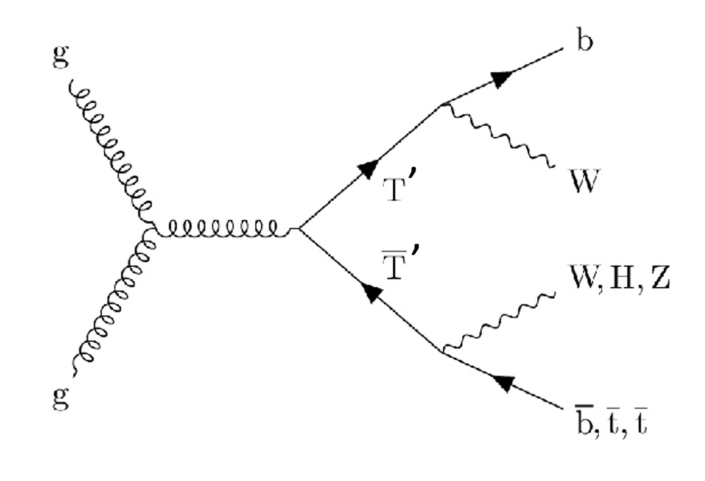
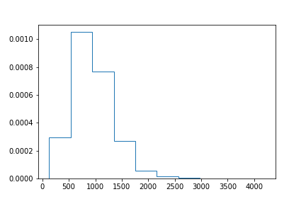
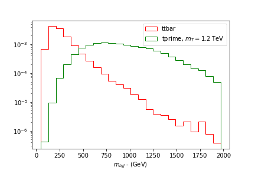
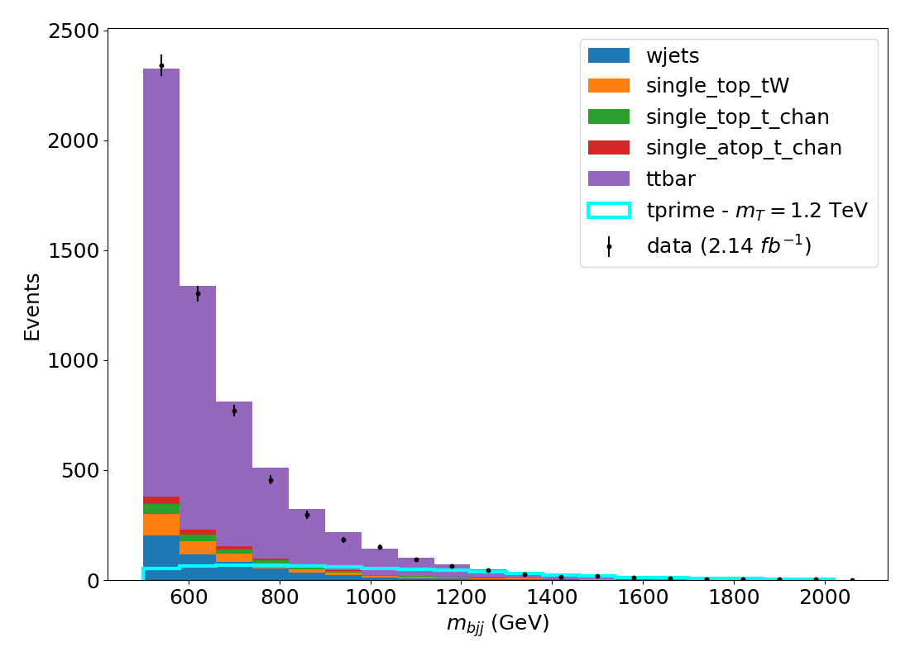
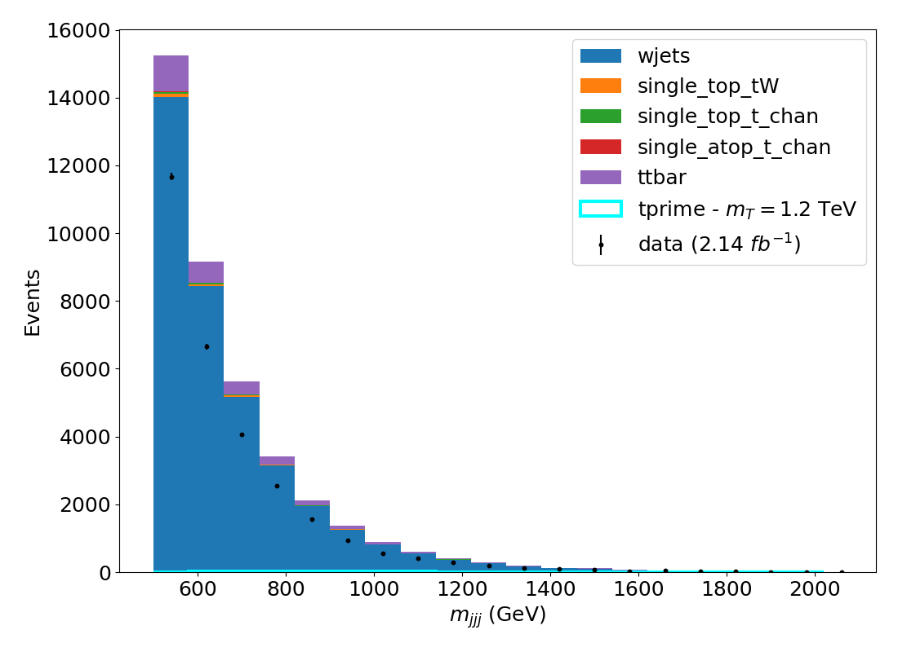
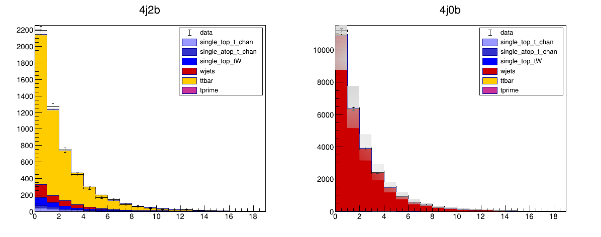
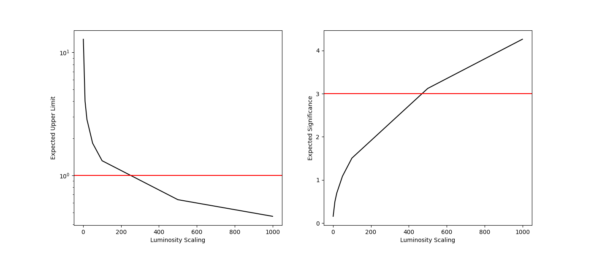

# Exercise 4 - Searching for a New Physics Signal

Measuring signal rates and cross-sections is not the only kind of analysis at the LHC. Many analyses are designed to search for new physics / new particles that may be produced in our collision events. Often an analysis that starts out as a measurement of some SM process gets adapted into a search for some new hypothetical particle. 

We are going to modify our analysis from a measurement of the $t\bar{t}$ cross-section to a search for a new particle - a $T^{\prime}$ (pronounced "T prime"). Below is an example Feynman diagram for pair production of the $T^{\prime}$ particle. 

. 

You can see that the decay products of the $T^{\prime}$ particles will involve top and bottom quarks (as well as vector bosons) so we should expect a similar final state as in our $t\bar{t}$ cross-section measurement. This means that all of the data and simulated samples we used before can be re-used for this search! 

## T-prime simulation 

First, we will need to run over a simulated sample of $T^{\prime}$ production. As is typical in searches for new physics, the model that we have in mind will have one or more parameters. In this case, the parameter is the mass of the $T^{\prime}$ particle. We will look for a $T^{\prime}$ particle with a mass of 1.2 TeV. 

As usual, start the `cms_python` container and open Jupyter Lab with, 

```
docker start -i cms_python
jupyter lab --ip 0.0.0.0 --port 8888 --no-browser
```

!!! Question 
    Add the new sample to your `ntuples.json` file with the information needed for the $T^{\prime}$ signal sample. 

    ```
    File path : "root://eospublic.cern.ch//eos/opendata/cms/derived-data/POET/23-Jul-22/RunIIFall15MiniAODv2_TprimeTprime_M-1200_TuneCUETP8M1_13TeV-madgraph-pythia8_flat/5A744C3D-EA4C-4C35-9738-BF878E063562_flat.root"
    Filter efficiency : 1
    Cross-section : 1 
    Number of events :253993 
    filter_eff = 1
    ```

/// details | Solution 
I have added a new file `ntuples_with_tprime.json` with the new information added to the `exercise4solutions` folder. The extra information that should be added to the JSON looks like, 
```
    "tprime":{
        "xsec": 1,
        "filter_eff": 1.0,
        "nominal": {
            "files": [
                {
                    "path": "root://eospublic.cern.ch//eos/opendata/cms/derived-data/POET/23-Jul-22/RunIIFall15MiniAODv2_TprimeTprime_M-1200_TuneCUETP8M1_13TeV-madgraph-pythia8_flat/5A744C3D-EA4C-4C35-9738-BF878E063562_flat.root",
                    "nevts": 253993
                }
            ],
            "nevts_total": 253993
        }
    }
```
///

Let's take a look at our observable $m_{bjj}$ for the $T^{\prime}$. Copy the code below into a cell in a jupyter notebook to apply our signal selection (4j2b) to the signal sample. You should hopefully recognize this code as our signal region selection and observable calculation from earlier exercises. 

```python
import uproot
import numpy as np
import awkward as ak

from coffea.nanoevents import NanoEventsFactory, BaseSchema
from agc_schema import AGCSchema

import matplotlib.pyplot as plt

events = NanoEventsFactory.from_root( 
    "root://eospublic.cern.ch//eos/opendata/cms/derived-data/POET/23-Jul-22/RunIIFall15MiniAODv2_TprimeTprime_M-1200_TuneCUETP8M1_13TeV-madgraph-pythia8_flat/5A744C3D-EA4C-4C35-9738-BF878E063562_flat.root"
    , schemaclass=AGCSchema, treepath='events').events()


# Object selection
selected_electrons = events.electron[(events.electron.pt > 30) & (abs(events.electron.eta)<2.1) & (events.electron.isTight == True) & (events.electron.sip3d < 4 )]
selected_muons = events.muon[(events.muon.pt > 30) & (abs(events.muon.eta)<2.1) & (events.muon.isTight == True) & (events.muon.sip3d < 4) & (events.muon.pfreliso04DBCorr < 0.15)]
selected_jets = events.jet[(events.jet.corrpt > 30) & (abs(events.jet.eta)<2.4) ]

# Event selection
event_filters = ((ak.count(selected_electrons.pt, axis=1) + ak.count(selected_muons.pt, axis=1)) == 1)

# Separate event selection into signal region and control region 
event_filters_SR = event_filters &  (ak.count(selected_jets.corrpt, axis=1) >= 4) & (ak.sum(selected_jets.btag >= 0.8, axis=1) >= 2)

selected_events_SR = selected_jets[event_filters_SR]

trijet = ak.combinations(selected_events_SR, 3, fields=["j1", "j2", "j3"])
j1,j2,j3 = ak.unzip(trijet)
has_bjet = (ak.sum(j1.btag>=0.8,axis=1)+ak.sum(j2.btag>=0.8,axis=1)+ak.sum(j3.btag>=0.8,axis=1)>0)
trijet = trijet[has_bjet]
trijet["p4"] = trijet.j1 + trijet.j2 + trijet.j3
trijet_mass = trijet["p4"][ak.argmax(trijet.p4.pt, axis=1, keepdims=True)].mass
observable = ak.flatten(trijet_mass).to_numpy()

plt.hist(observable,histtype='step',density=True)
```

You should see a distribution similar to the one below, 



!!! Question 
    Compare the distribution of the observable to the one you would see for the `ttbar` simulation - is this what you expect. How would you modify the selection for the signal region to reduce the amount of `ttbar` background events?

/// details | Solution 
If you run over the `ttbar` sample and compare the distribution from that and from the $T^{\prime}$ signal, you should see something like the figure below, 



It's clear that the value of $m_{bjj}$ for the $T^{\prime}$ is much larger than for $t\bar{t}$. This is because the mass of the $T^{\prime}$ particle is much larger than that of a top quark and so the invariant mass of these decay products will be much larger too. From the distributions, selecting events with $m_{bjj}> 500$ GeV will significantly reduce the amount of $t\bar{t}$ background while keeping most of the $T^{\prime}$ signal. 
/// 

## T-prime search analysis

We need to modify our Analysis notebook to perform the search for the $T^{\prime}$ particle. Most of the notebook will stay the same, except that we should change the bins for our observable to better suit the search for the new signal. We can do this by modifying the `bins` array in the notebook, 

```
obsbins=np.arange(500,2080,80)
```

Since we expect the invariant masses of events from the $T^{\prime}$ events to be much larger than our SM processes. 

!!! Question
    Adapt your analysis notebook to include the $T^{\prime}$ signal. Remember to, 
    1. Include the $T^{\prime}$ signal sample in your `ntuples.json` and modify the observable range to something more suitable for the search for the new particle. 
    2. Include both the signal region (4j2b) and  control region (4j0b) in your processing - the signal will appear in both but you should find a lot less signal in the 4j0b region.
    3. You might wish to name the output `.csv` something different to avoid overwriting your previous work.
    4. Remember to also include the distributions for `jesUp` and `jesDown` for all of the simulated samples. 

    You can start from the notebook I provided in `exercise2solutions/FullAnalysisWithControlRegion.ipynb` if you prefer. 

/// details | Solution 
I have put a notebook under `exercise4solutions/SearchAnalysis.ipynb` which will produce a `.csv` file called `tprime_1200GeV_search_allregions_mbjj.csv`, that contains the histograms for data and simulation in the signal and control regions. the notebook will produce the figures below showing the distributions with this modified selection, 

///

## Statistical Search 

Now that we have the new histograms, we are nearly ready to do some statistical calculations to test if our data is compatible with there being a $T^{\prime}$ signal with a mass of 1.2 TeV in it. The way we typically do this is by calculating an upper limit on the amount of new signal (`r`) present in the data. We'll need to use the `combine` software for this, so start the `cms_combine` container, 

```
docker start -i cms_combine
```

We need to modify our datacards. We need to point to the new `.csv` file that we created and we need to tell `combine` that our "signal" this time is the $T^{\prime}$ process and the $t\bar{t}$ is now a background process. Remember that in the datacards, any process with an ID $\leq$ 0 is considered as a signal, and will be scaled with the signal strength parameter `r`.  We need to add a new columnd to the `process` lines for the `tprime` process with the ID 0. We also should add a column for each of the systematic uncertainty lines. 

We should also allow the `ttbar` process to freely float in the fit. To do this, we add another `rateParam` line to introduce another parameter that will scale the `ttbar` process, separately from the `wjets_norm` and `r` parameters. Finally, remember to increase the value of `jmax` by 1 since we now have one additional background process (since the $t\bar{t}$ is now a background). 

Below is what the signal region datacard should now look like, 

```
imax 1
jmax 5
kmax 4
# -----------------------------------------------------------------------------------------
shapes data_obs signalregion tprime_1200GeV_search_allregions_mbjj.csv signalregion:data:nominal,sum_w:sum_ww
shapes *        signalregion tprime_1200GeV_search_allregions_mbjj.csv signalregion:$PROCESS:nominal,sum_w:sum_ww signalregion:$PROCESS:$SYSTEMATIC,sum_w:sum_ww 
# -----------------------------------------------------------------------------------------
bin         signalregion
observation -1
# -----------------------------------------------------------------------------------------
bin         signalregion  signalregion        signalregion       signalregion   signalregion  signalregion
process     ttbar         single_atop_t_chan  single_top_t_chan  single_top_tW  wjets         tprime 
process     5             1                   2                  3              4             0 
rate        -1            -1                  -1                 -1             -1            -1 
# -----------------------------------------------------------------------------------------
wjets_norm rateParam signalregion wjets 1 [0,5]
ttbar_norm rateParam signalregion ttbar 1 [0,5]
lumi  lnN   1.023        1.023                1.023              1.023          -             1.023
ideff lnN   1.01         1.01                 1.01               1.01           -             1.01
btag  lnN   1.03         1.03                 1.03               1.03           1.03          1.03
jes   shape 1            1                    1                  1              1             1 
signalregion autoMCStats 0  
```

!!! Question
    We also need to update the control region datacard. Make the appropriate changes to the control region datacard, similarly to what we changed for the signal region datacard. 

/// details | Solution 
The control region datacard should look like the following, 
```
imax 1
jmax 5
kmax 4
# -----------------------------------------------------------------------------------------
shapes data_obs controlregion tprime_1200GeV_search_allregions_mbjj.csv controlregion:data:nominal,sum_w:sum_ww
shapes *        controlregion tprime_1200GeV_search_allregions_mbjj.csv controlregion:$PROCESS:nominal,sum_w:sum_ww controlregion:$PROCESS:$SYSTEMATIC,sum_w:sum_ww 
# -----------------------------------------------------------------------------------------
bin         controlregion
observation -1
# -----------------------------------------------------------------------------------------
bin         controlregion controlregion       controlregion      controlregion  controlregion  controlregion
process     ttbar         single_atop_t_chan  single_top_t_chan  single_top_tW  wjets          tprime 
process     5             1                   2                  3              4              0 
rate        -1            -1                  -1                 -1             -1             -1
# -----------------------------------------------------------------------------------------
wjets_norm rateParam controlregion wjets 1 [0,5]
ttbar_norm rateParam controlregion ttbar 1 [0,5]
lumi  lnN   0.023        0.023                0.023              0.023          -              1.023
ideff lnN   1.01         1.01                 1.01               1.01           -              1.01
btag  lnN   0.99         0.99                 0.99               0.99           0.99           0.99 
jes   shape 1            1                    1                  1              1              1 
controlregion autoMCStats 0
```
///

!!! tip "Challenge"
    Instead of letting the `ttbar` process float freely, use our previous measurement to constrain the rate within the uncertainty we obtained from Exercise 3. To do this you could use a `lnN` type uncertainty or add a `param` constraint term to the `ttbar_norm` parameter as described [here](https://cms-analysis.github.io/HiggsAnalysis-CombinedLimit/latest/part2/settinguptheanalysis/#unbinned-or-parametric-shape-analyses). 


### Fit of $T^{\prime}$ signal 

Now let's run our fit again on the combined regions, but this time our measured signal strength `r` will correspond to the amount of $T^{\prime}$ signal, relative to the input cross-section. In our case, we set the cross-section to 1pb so the value of `r` directly corresponds to the measured cross-section in data. 
If you didn't manage to run your notebook for the previous section, you can use the `tprime_1200GeV_search_allregions_mbjj.csv` file I provided in the `exercise4solutions` folder.  

First, combine the datacards (you may have different names for your datacards) 
```sh
combineCards.py signalregion=signalregion_search_mbjj.txt controlregion=controlregion_search_mjjj.txt > combined_search.txt
```

And we run the fit as usual, 
```sh
combine combined_search.txt -M FitDiagnostics --saveShapes --saveWithUncert -n Search --cminDefaultMinimizerStrategy 0 
```

Note, I recommend adding the option `--cminDefaultMinimizerStrategy 0` as above to make this run faster. 

!!! Warning
    If the code terminates with the message "`Segmentation fault`", then run the following command in your terminal to fix it, 
    ```sh
    ulimit -s unlimited; ulimit -u unlimited
    ```

You should see something like the following, 
```
 --- FitDiagnostics ---
Best fit r: 8.8185e-06  -8.8185e-06/+1.02713  (68% CL)
Done in 0.33 min (cpu), 0.33 min (real)
```

So the fitted signal strength `r` is basically 0 - sadly no sign of the new physics signal in our data! We can instead set upper limits on how much signal would have to be there, before we would be able to detect it in the data. 

!!! Question 
    Plot the post-fit distributions from the output of the previous command. Would  you expect the fit for the signal plus background to be different to the one for the background only? Why?

/// details | Solution
We can re-use code from Exercise 3, but use the file `fitDiagnosticsSearch.root`. You should see something like the plots below, 



Since the fitted signal strength was very close to 0, we expect the background only fit (fixing `r`=0) to be the same as the signal plus background (letting `r` float in the fit) fit. 
///

### Upper limit calculation 

We can calculate an upper limit on the cross-section (in pb) using `combine` with the `AsymptoticLimits` method. To do this, we can run the following command in the terminal, 

```sh
combine combined_search.txt -M AsymptoticLimits 
```

which should yield something like the following output,

```
 -- AsymptoticLimits ( CLs ) --
Observed Limit: r < 5.2495
Expected  2.5%: r < 6.9236
Expected 16.0%: r < 9.2728
Expected 50.0%: r < 12.9375
Expected 84.0%: r < 18.2492
Expected 97.5%: r < 24.5932
``` 

Let's break this down. The first line tells us that the calculation is based on the `CLs` criterion which we saw in the lectures - by default, this command runs 95% confidence level (CL) upper limits. The Observed limit tells us that the 95% CL upper limit is about 5.25. Remember that the signal strength in our setup is normalised so that `r=1` corresponds to 1 pb, the upper limit tells us that we can exclude (at the 95% confidence level) a $T^{\prime}$ signal with mass of 1.2 GeV with a cross-section larger than 5.25 pb, given the data we saw. 

We also see additional results for the *Expected limits*. These numbers tell us how much signal we would expect to exclude in the data. Remember that upper limits are in fact random values, and so we can think about the distribution of upper limits. The values shown indicate the median of that distribution and several quantiles. The Median expected upper limit (`Expected 50.0%`) is around 13pb, which tells us that our data had quite a large under-fluctuation compared to what we would have expected, which allows us to set a better limit than what we would have expected! 

In fact, for this particular signal, we would expect (theoretically) a cross-section of about 0.0118 pb so we certainly cannot have expected to exclude this signal given our dataset size since 0.0118 $<<$ 13. We can see how much more data we would need to collect before we expect to exclude (or even discover!) this signal  

### Sensitivity projections 

We can add one more `rateParam` to our datacards which will scale all of our processes by a given value. Add the following lines to your combined datacard, 

```
lumi_scale    rateParam * * 1
nuisance edit freeze lumi_scale
```
The first line tells `combine` to introduce an additional parameter that scales all processes in all channels (this is what `* *` means) by the value of `lumi_scale`, with a default value of 1. We can set this value to anything in the command line later. The second line tells `combine` to freeze this parameter - we do not want it to float in our fits. 

Now let's see what the expected upper limits would be if we increase our data sample size (value of luminosity scaling `lumi_scale`) by a factor of 10, 
```sh
combine combined_search.txt -M AsymptoticLimits --setParameters lumi_scale=10 --run blind 
```
Note that we only want to run the expected value for these projection studies. The option `--run blind` tells `combine` to ignore the data. 
Now we will see something like the following, 

```
 -- AsymptoticLimits ( CLs ) --
Expected  2.5%: r < 2.8890
Expected 16.0%: r < 3.8540
Expected 50.0%: r < 5.3594
Expected 84.0%: r < 7.4743
Expected 97.5%: r < 9.9902
```

The Median expected limit is now 5.3 pb, much smaller than before! As we expected, more data means a better  expected upper limit. We can also calculate the expected significance for 10x the amount of data, using a similar command, 

```sh
combine combined_search.txt -M Significance  --expectSignal 1 -t -1 --setParameters lumi_scale=10
```
which tells `combine` to calculate the significance we would expect to see for a signal where we have 10x as much data. 

!!! Question 
    Calculate the luminosity scale factor that we would need in order for 
    1. The expected limit to be smaller than a cross-section of 1 pb
    2. The expected significance to reach 3-sigma, i.e how much data we would need before we expect to see strong evidence of a signal with a cross section of 1 pb. 

    For this question, you should remove the `autoMCStats` lines from the datacard. We know that these uncertainties should improve by simply generating more simulated events so we shouldn't include them in these projection studies. This is of course a real problem for experimental projections since we also need to make sure we have the computing available to simulate enough events - but that's a different topic!

/// details | Solution 
You can run the commands setting the value of `lumi_scale` to larger values with a simple bash for loop, for example, 
```
for i in 1 10 20 50 100 200 500 1000;  do combine combined_search.txt -M Significance  --expectSignal 1 -t -1 --setParameters lumi_scale=$i -n scale.$i; done 
```

Below is a plot showing the  expected upper limit and the expected significance as a function of the `lumi_scale` value. 


The code used to make the plot is below, 
```python
import ROOT
import matplotlib.pyplot as plt

#  higgsCombinescale.10.AsymptoticLimits.mH120.root 
#  higgsCombinescale.10.Significance.mH120.root      

lsS = [1, 10, 20, 50, 100, 500, 1000]

def getExpLim(f):
    fi = ROOT.TFile.Open(f)
    tr = fi.Get('limit')
    tr.GetEntry(2) # for our command, entry 2 is the 50% limit
    return tr.limit

def getExpSig(f):
    fi = ROOT.TFile.Open(f)
    tr = fi.Get('limit')
    tr.GetEntry(0) # for our command, entry 2 is the 50% limit
    return tr.limit

lim_y = []
sig_y = []

for ls in lsS:
    lim_y.append(getExpLim("higgsCombinescale.%d.AsymptoticLimits.mH120.root"%ls))
    sig_y.append(getExpSig("higgsCombinescale.%d.Significance.mH120.root"%ls))

fig, (ax1,ax2) = plt.subplots(1,2,figsize=(14,6))
ax1.plot(lsS,lim_y,color='black')
ax1.set_xlabel("Luminosity Scaling")
ax1.set_ylabel("Expected Upper Limit")
ax1.axhline(1,color='red')
ax1.set_yscale('log')

ax2.plot(lsS,sig_y,color='black')
ax2.set_xlabel("Luminosity Scaling")
ax2.set_ylabel("Expected Significance")
ax2.axhline(3,color='red')
```
///

Very often, we use these expected sensitivities and projections at the LHC in order to design the most sensitive analyses and to determine future strategies for new particle physics experiments. Studies similar to the ones we've just done are in fact used in discussions for what to build (if anything) as the the next generation of particle collider and give us a roadmap towards future discoveries in particle physics!


!!! tip "Challenge" 
    For the $T^{\prime}$ search analysis, we chose to use the $m_{bjj}$ observable in the range $500--2000$ GeV, based on the distribution we saw for the $T^{\prime}$ and $t\bar{t}$ samples. In real analyses, we typically optimize the selection and observable choice based on the sensitivity to the signal we are looking for. Try and find a better range for the observable, or if you have already started the machine learning lectures, why not try to train a machine learning model to separate the signal from the backgrounds and use the output from that to search for the $T^{\prime}$ signal. Can you find a more sensitive way to perform the search? You could use the expected upper limit as in the calculation above, or the expected significance as your metric for the sensitivity. To calculate the *expected* significance, you can use the command below, 
    ```
    combine combined_search.txt  -M Significance --expectSignal 1 -t -1 
    ```