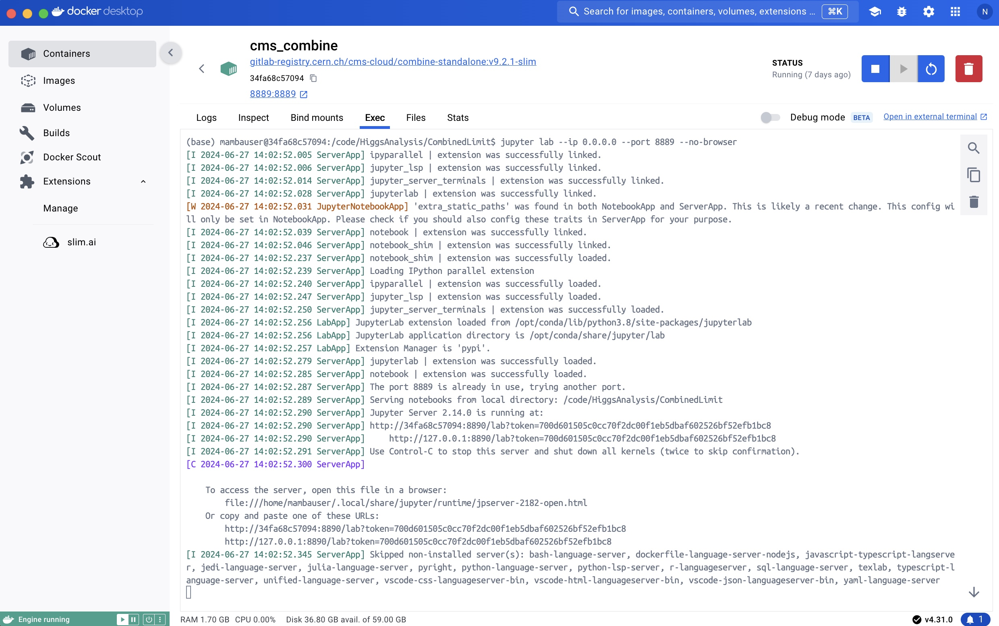

# Getting Started

To complete these exercises, we will be using two container images, with the software installed for you. In the examples here, we will use [Docker](https://www.docker.com/) to run the images. The Docker desktop is available for mac, windows and linux so follow the link and download the right installation for your personal laptop. You should start by downloading the Docker desktop for your laptop (click [here](https://www.docker.com/) and follow the instructions). You will need to setup an account to do so. 

Once you have the Docker desktop installed, make sure it is running and download the two containers that we'll need for the exercises using the terminal commands below. Note that the Docker desktop has its own terminal if you prefer to use that. If you are using a linux machine, be sure that you allow all users to access the Docker deamon otherwise you will need to add `sudo` to the start of your `docker run` commands. Below is what the Docker desktop looks like for Mac, where you can see which containers are running. 


!!! Warning 
    To obtain the containers, we need to use a terminal on your laptop. Mac / Linux users can just use the standard terminal for this. Windows users should use Powershell. Alternatively, if you have the latest version of Docker Desktop, you will find a terminal icon at the bottom of the window that will open a terminal (see below). You can also use this one to obtain the containers. Once you have the container, you can use the terminal inside the container environment (best is in the jupyter notebook). 


## Python environment for CMS Open Data datasets 

Obtain the `cms_python` container using, 

```bash
docker run -it --name cms_python -P -p 8888:8888 gitlab-registry.cern.ch/cms-cloud/python-vnc:python3.10.5
```

Now that you're inside the container, run the following to get all of the necessary scripts and install some additional packages. 
```bash
pip install vector coffea==0.7.21
```

You can exit the container at any time by typing `exit` in the terminal. To restart the python container, open a terminal and enter 
```bash
docker start -i cms_python
```

## Combine package for statistical analysis

Obtain the `cms_combine` container using, 

```bash
docker run -p 127.0.0.1:8889:8889 --name cms_combine -it gitlab-registry.cern.ch/cms-cloud/combine-standalone:v9.2.1-slim
```

If you like to make plots with python instead of using ROOT, then you should also install `matplotlib` and upgrade `numpy` inside this container by running the following command in the terminal inside the container. 
```sh
pip install matplotlib
pip install numpy==1.24.0
```
You may find that you get errors when importing matplotlib. If that happens, a solution seems to be to uninstall and re-install numpy with

```sh
pip uninstall numpy
pip install matplotlib
pip install numpy==1.24.0
```

You can exit the container at any time by typing `exit` in the terminal. 

To restart the combine container, open a terminal and enter 
```bash
docker start -i cms_combine
```

## Jupyter Notebooks    

As much as possible, we will use Juptyer notebooks to write and run code for these exercises. You can launch JupterLab from either of the two containers by using the following command inside the terminal after starting the container. 

```bash
jupyter lab --ip 0.0.0.0 --port XXXX --no-browser
```

where `XXXX` should be `8888` for the python container, and `8889` for the combine container. 

The output will give you a link that you can paste in your preferred internet browser to open the JupyterLab environment. The output will look similar to the one below, 


Or you can also run this command in the terminal ("Exec") from the dashboard from Docker desktop in either container like below, 




Copy one of the URL paths into the URL bar in your preferred browser. You should see something like the following. In this example I have  launched JupyterLab from inside the combine container, 


From here, we can open a new terminal, text file or notebook. On the left you can see a file browser that shows all of the files contained in the container. You can modify/copy/delete these using the file browser by right clicking on them.


### Notebooks 

Selecting a "Python 3" Juypter notebook allows you to run code python and see the output all in one page. You can type code into a cell and run it by either pressing the play button ( &#9658;) at the top or using `shift`+`enter` on your keyboard, as in the image below 


Create new cells by using the `+` button at the top. If you press the fast-fwd &#9193;
 button at the top, all of the cells in the whole notebook will be run one after the other. Notebooks will automatically save every so often so your work will be kept. The files will be named with the `.ipynb` extension.

### Terminal 

You will need to use the terminal for some commands. For this, you can either use the same terminal as you used to start docker, or you can open a new "Terminal" in your browser from the Launcher tab, 


!!! Warning 
	The browser based terminal inside JupyterLab is very useful but is defaulted to use a fairly cumbersome shell. If you use this terminal, you might find it helpful to first type `bash` into the terminal to use the BASH terminal shell, which is much better. 


### CSV files 

Since our data structures will be mostly Pandas dataframes, you might want to install the Jupyter spreadsheet editor that allows you to both view and edit CSV files, 
```bash
pip install jupyterlab-spreadsheet-editor
```
You can do this in both of the containers but you don't need to install this for the exercises.


## Moving files around 

From time to time, we will need to move files between containers or to our own computers. You can do this by downloading the file from the browser (right click on a file in the file browser and select "download") or you can use the `docker cp` tool. For example to transfer a file called "myfile.txt" from your local desktop to the `cms_python` container, you can run, 

```sh
docker cp ~/Desktop/myfile.txt cms_python:/code/
```

in a terminal on your local machine. You should see a message with the words ```Sucessfully copied ...``` if everything worked.  You can also copy files from the containers to your local machine by reversing the order of the locations in the command above, and you can copy files between containers. 

!!! Warning 
    With the way we are downloading and starting the containers, anything you create will still be there the next time you start the container. However, if you delete the container from Docker desktop then everything you did will be gone! You should make sure you copy any files/work you want to keep to your local computer using the `docker cp` commands above before you permenantly delete the containers. 
